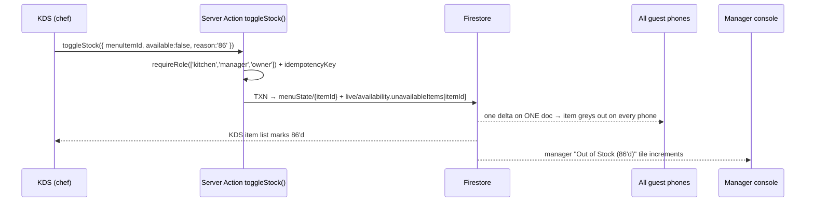
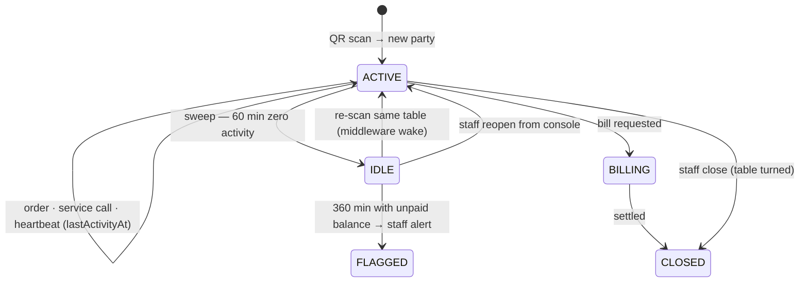
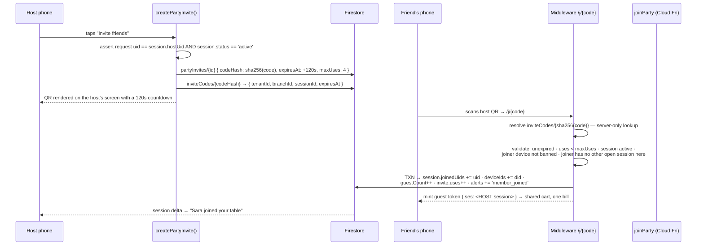

# TableBells — Technical Architecture & Security Blueprint

**Version:** 3.0 — supersedes all prior versions in full
**Stack:** Next.js 15 (App Router, RSC, Node-runtime middleware) · Firebase (Firestore, Auth, App Check, Cloud Functions v2, Storage, FCM) · Tailwind CSS
**Firestore region:** `me-central2` (Doha) — fixed and immutable. Cloud Functions, Cloud Tasks, and Cloud Run co-located in `me-central2`.
**Locale:** `en` / `ar` (RTL) · **Currency:** AED, integer fils · **Tax:** UAE VAT 5%, **inclusive** · **Timezone:** Asia/Dubai

> Scope: schema, real-time flows, trust boundaries, threat models, directory layout, payment seams. No UI implementation. Every collection path, rule, action, and file path below is a contract for the build phase.

---

## 0. Trust Model

### 0.1 The four principals

| Principal | Auth | Trust level | May write to Firestore |
|---|---|---|---|
| **Guest** | Anonymous, App Check attested | **Untrusted** — assume every guest is hostile | `orderRequests`, `serviceCalls`, `partyJoinRequests` — **create only** |
| **Staff** | Email/password (non-anonymous) + device-bound PIN | Semi-trusted, role-scoped, fully audited | Operational collections within their branch |
| **Server** | Admin SDK inside Next.js / Cloud Functions | Trusted | Everything — bypasses rules by design |
| **Platform** | Non-anonymous + MFA + IP allowlist | Trusted, audited, impersonation-logged | Cross-tenant reads; writes via audited actions |

### 0.2 The five architectural invariants

Everything downstream follows from these. A change to any one is a re-architecture, not a patch.

1. **Guest tokens are anonymous; staff rules assert `sign_in_provider != 'anonymous'`.** The separation is arithmetic, not conventional (§1.4).
2. **Guests may only ever `create`.** No `update`, no `delete`, on any path, ever. Mutation and voiding are staff-only. This is what makes data ransom structurally impossible (§8.6).
3. **Guests never transmit money.** A client payload carries `itemId` and `qty` and nothing else. Price exists only server-side (§8.3).
4. **Physical possession is the guest's credential.** A cryptographic table slug printed on the table is the only thing that admits a guest to a session. Nothing is guessable (§8.1).
5. **VAT is derived once, from surviving lines, by `splitInclusive()`.** One function, one call site pattern, no incremental arithmetic (§1.9, §2.6).

### 0.3 Trust boundary map

```
┌─ UNTRUSTED ────────────────────────────────────────────────────────────┐
│  Guest browser: anonymous token, App Check attestation, httpOnly cookie│
│  May: read own party's data · CREATE order requests + service calls    │
│  May NOT: update anything · delete anything · send a price · read      │
│           another party · read any staff collection                    │
└──────────────┬─────────────────────────────────────────────────────────┘
               │ App Check gate (pre-rules, per-product enforcement)
               │ Firestore Security Rules (ownership · shape · length · no-HTML)
┌──────────────▼─────────────────────────────────────────────────────────┐
│  TRUSTED: Cloud Function `priceOrderRequest` — SOLE price authority    │
│           Next.js Server Actions (Admin SDK) — staff mutations         │
│           Node middleware — slug resolution, cookie wake, ban gate     │
└──────────────┬─────────────────────────────────────────────────────────┘
               │
┌──────────────▼─────────────────────────────────────────────────────────┐
│  Firestore me-central2 · PITR 7d · daily locked-bucket exports         │
└────────────────────────────────────────────────────────────────────────┘
```

---

## 1. Database Schema & Multi-Tenancy

### 1.1 Isolation strategy

Tenant data is path-contained under `tenants/{tenantId}/…`; nothing tenant-owned exists at the root. Isolation rests on four independent layers, so a failure in any one does not leak data:

1. **Path containment** — the tenant id is a path segment, comparable against the token with zero reads.
2. **Custom claims** — tenant, branch, and role are minted into the ID token; rules never `get()` a membership doc on the hot path.
3. **Provider assertion** — every staff rule requires a non-anonymous sign-in provider (§1.4).
4. **Party ownership** — every guest read and create is additionally scoped to a session the caller belongs to (§8.2).

### 1.2 Root collections

```
/tenants/{tenantId}
/tableSlugs/{slug}          → { tenantId, branchId, tableId, version, active }   §8.1
/inviteCodes/{codeHash}     → { tenantId, branchId, sessionId, expiresAt }       §5
/platformUsers/{uid}
/platformMetrics/{YYYY-MM-DD}
/auditLogs/{logId}          // append-only, immutable, cross-tenant
/webhookEvents/{eventId}    // payment idempotency, TTL 90d
/idempotencyKeys/{key}      // action dedupe, TTL 24h
```

`tableSlugs` and `inviteCodes` are **server-only** — `allow read, write: if false`. They are resolved exclusively by the Admin SDK inside middleware. A client never queries them, so the slug space cannot be enumerated through Firestore even with a valid token.

### 1.3 `tenants/{tenantId}`

```ts
{
  code: "TB-0492",
  legalName: "Alserkal Specialty Coffee LLC",
  displayName: "Alserkal Roastery & Kitchen",
  trn: "AE1004928190003",                     // printed on every receipt
  status: "active" | "trial" | "suspended" | "churned",
  plan: "micro" | "standard" | "multi_branch",
  claimEpoch: 3,                              // bump = revoke all staff tokens
  locales: { default: "en", enabled: ["en", "ar"] },
  currency: "AED",
  tax: { mode: "inclusive", ratePpm: 50000 }, // 5%
  branding: { logoPath, primaryHex: "#E85D3F" },
  limits: {
    maxOrderLines: 40, maxQtyPerLine: 20,
    maxNoteChars: 150,                        // §8.4
    maxOrdersPerSessionPer90s: 3,
    orderApprovalThresholdFils: 50000         // staff-approval ceiling, evaluated on
                                               // EVERY order, no session-history exemption — §8.7
  },
  featureFlags: { payments: false, partySharing: true, guestInitiatedMove: true },
  createdAt, suspendedAt, suspendedReason
}
```

**Tenant-global subcollections:**

```
/members/{uid}                  // staff — §1.6
/menuCategories/{categoryId}
/menuItems/{itemId}
/modifierGroups/{groupId}
/stations/{stationId}
/guestDevices/{deviceId}        // §3.2 — cookie identities
/security/bannedUsers           // §8.7 — { uids: [...] }
/security/bannedDevices         // §8.7 — { ids: [...] }
/bannedIdentities/{banId}       // §8.7 — full audit record
/auditLogs/{logId}
/branches/{branchId}
```

### 1.4 Custom claims — the guest/staff split, enforced mathematically

```jsonc
// STAFF — email/password or federated. NEVER anonymous.
{ "stf": true, "tid": "tb_0492", "bids": ["br_alserkal"],
  "role": "owner|manager|cashier|server|kitchen", "sid": "stf_410", "ver": 3 }

// GUEST — anonymous provider only.
{ "gst": true, "tid": "tb_0492", "bid": "br_alserkal",
  "ses": "ses_9f2", "did": "dev_a71c", "exp": "<6h>" }
```

The predicate that carries the whole split:

```
function provider() { return request.auth.token.firebase.sign_in_provider; }
function isStaff(t) {
  return request.auth != null
      && provider() != 'anonymous'          // ← set by Firebase Auth, NOT a custom claim
      && request.auth.token.stf == true
      && request.auth.token.tid == t
      && request.auth.token.role in ['owner','manager','cashier','server','kitchen'];
}
function isGuest(t, b) {
  return request.auth != null
      && provider() == 'anonymous'
      && request.auth.token.gst == true
      && request.auth.token.tid == t
      && request.auth.token.bid == b;
}
```

**Why this cannot be defeated.** `firebase.sign_in_provider` is written into the JWT by Firebase Auth at mint time from the authentication method actually used. It is **not** a custom claim: `setCustomUserClaims()` cannot write it, cannot shadow it, and rejects reserved keys in the `firebase` namespace outright. So even if an attacker obtained a token-minting path and set `stf: true, role: 'owner'` on an anonymous user, `provider() != 'anonymous'` still evaluates false and every staff rule fails closed. The guest and staff predicates are mutually exclusive by construction — no token can satisfy both, because no token can carry two sign-in providers.

Three further locks back it up: disjoint claim keys (`gst` vs `stf`), guest tokens carrying no `role` key at all (so `role in [...]` is undefined-false), and `mint.ts` being the single code path that sets either, returning a discriminated union that cannot produce a hybrid.

### 1.5 Branch and operational collections

```ts
// tenants/{t}/branches/{branchId}
{
  name: "Alserkal Branch",
  timezone: "Asia/Dubai",
  zones: [ { id: "zone_a", name: { en: "Indoor Lounge", ar: "…" } } ],
  serviceHours: [ { day: 0, open: "08:00", close: "23:00" } ],
  status: "open" | "closed" | "maintenance",
  session: { idleAfterMin: 60, abandonAfterMin: 360, maxPartiesPerTable: 6 },
  sla: { waiterCallSec: 60, billRequestSec: 90, ticketPrepSec: 600 },
  menuVersion: 14,
  settings: { currency: "AED", vatPpm: 50000, receiptFooter: "" }   // ADR-11 — Manager Store Settings. vatPpm = VAT parts-per-million (50000 = 5%). Absent ⇒ AED/5%/"".
}
```

**`settings` (ADR-11).** Written by `updateBranchSettings` (`canManageSettings`, Admin SDK — `branches/{b}` has no client write). `priceOrderRequest` reads `settings.currency` / `settings.vatPpm` and **snapshots both onto every `Order`** at price time; a later settings change never re-prices an existing ticket. `vatPpm` is an integer (parts-per-million) so no float touches §1.9's money path. `guest-boot.service.ts` also resolves `settings` into `GuestSessionContext` so the guest menu/cart show the right currency.

```
branches/{b}/tables/{tableId}
branches/{b}/sessions/{sessionId}                    // a PARTY — §5
branches/{b}/sessions/{sessionId}/alerts/{alertId}   // guest-facing alerts
branches/{b}/orderRequests/{requestId}               // GUEST-WRITABLE, create-only — §8.3
branches/{b}/orders/{orderId}                        // priced KDS ticket, server-written
branches/{b}/orders/{orderId}/events/{eventId}       // append-only transition log
branches/{b}/serviceCalls/{callId}                   // GUEST-WRITABLE, create-only
branches/{b}/partyJoinRequests/{reqId}               // GUEST-WRITABLE, create-only — §5
branches/{b}/partyInvites/{inviteId}                 // server-only
branches/{b}/staffAlerts/{alertId}
branches/{b}/bills/{billId}
branches/{b}/bills/{billId}/payments/{paymentId}     // §6
branches/{b}/menuPublished/{version}                 // guest read snapshot — written by publishMenu (ADR-8); categories now carry name+sortIndex
branches/{b}/menuDraft/current                       // ADR-8 — Manager Menu Maker working tree; owner/manager read only, Admin-SDK write
branches/{b}/live/availability                       // single doc — global 86, §2.4
branches/{b}/devices/{deviceId}                      // staff terminals, KDS nodes
branches/{b}/counters/{counterId}
branches/{b}/analyticsDaily/{YYYY-MM-DD}
```

**`tables/{tableId}`** — multi-party, because two strangers at one table are two sessions (§5):

```ts
{
  code: "T-04", label: "Table 04", zoneId: "zone_a", seats: 4, sortIndex: 4,
  status: "available" | "occupied" | "attention" | "dirty" | "disabled",
  slug: "k9f2mXp4TvQ7",                  // §8.1 — the printed cryptographic slug
  slugVersion: 2, slugRotatedAt,
  parties: [                              // denormalized, bounded by maxPartiesPerTable
    { sessionId, label: "A", guestCount: 2, openTabFils: 9600,
      status: "active" | "idle" | "billing", riskFlagged: false, openedAt }
  ],
  partyCount: 2, openTabFils: 18400,
  activeCall: { callId, type: "waiter", priority: 1, createdAt } | null,
  assignedServerUid, lastSanitizedAt, nfcTagId: "04-A"
}
```

The `parties[]` array lets the floor grid render from **one 24-document listener** while showing per-party tabs.

### 1.6 `tenants/{t}/members/{uid}` — staff, device-bound PINs retained

```ts
{
  uid, displayName: "Omar Kassem", staffCode: "11",
  role: "owner" | "manager" | "cashier" | "server" | "kitchen",
  jobTitle: "Floor Server",
  branchIds: ["br_alserkal"], zoneIds: ["zone_a"], stationIds: ["stn_barista"],
  pinHash, pinUpdatedAt,                 // argon2id, self-describing encoded hash --
                                          // salt is embedded in pinHash itself (the
                                          // standard PHC-format string), not a
                                          // separate field. PATCHED: an earlier draft
                                          // of this schema listed `pinSalt` as its
                                          // own field; `server/auth/staff-pin.ts`'s
                                          // header explains why that would have meant
                                          // hand-managing raw salt/hash bytes for no
                                          // real benefit over the standard encoded form.
  pinFailedAttempts, pinLockedUntil,     // 5 strikes → 15-min lockout
  overrideAuth: true,                    // void, discount, refund, ghost-order ban
  status: "active" | "inactive" | "suspended",   // ADR-10 widened; any non-'active' blocks login
  lastActiveAt, createdAt, createdBy
}
```

**Managed by `staff.actions.ts` (ADR-10).** `upsertStaff` (create / edit / revoke) and `listStaff` (a sanitised roster — never returns `pinHash`) are the in-app CRUD, `canManageStaff` (manager/owner) gated, Admin SDK. **`role` is single**, not a set — `manager` already subsumes `cashier` / `server`. Creating an `owner` or granting `overrideAuth` is **owner-only**. Revoke = `status` → `inactive` / `suspended` (blocks next login) plus a best-effort Firebase token revoke; the standalone `tb_staff` cookie still lasts up to 8h (no denylist yet — the "device secret" third factor above is likewise still unbuilt).
`scripts/seed-staff-member.ts` remains the break-glass bootstrap for the first owner.

**A staff PIN is a second factor, never a credential.** Verification requires all three of: a valid non-anonymous Firebase session for the terminal's service account, the terminal's registered device secret (`devices/{deviceId}.secretHash`), and the PIN. A 4-digit PIN is 10⁴ of entropy — alone it is worthless, which is why it is only ever evaluated in combination with a device secret that never leaves the registered terminal. Rate limiting is per-device **and** per-member, so an attacker with one stolen tablet cannot brute-force across the roster.

`POST /api/auth/pin` returns a short-lived staff session cookie; the PIN itself is never stored, logged, or sent to Firestore from the client.

### 1.7 Guest-writable collections — exact shapes

These three are the entire attack surface a hostile guest can write to. Everything about them is constrained by rules (§1.10).

```ts
// branches/{b}/orderRequests/{requestId}   — CREATE ONLY
{
  sessionId: "ses_9f2",
  tableId: "tbl_04",
  lines: [ { itemId: "itm_0941", qty: 2, modifierOptionIds: ["opt_oat"] } ],  // NO PRICES
  note: "Less sugar please",              // ≤150 chars, no HTML — §8.4
  clientRequestId: "uuid-v4",             // idempotency
  createdBy: "anon_a1",                   // MUST equal request.auth.uid
  createdAt: <request.time>,
  status: "pending"                       // only 'pending' accepted on create
}

// branches/{b}/serviceCalls/{callId}      — CREATE ONLY
{
  sessionId, tableId,
  type: "waiter" | "water" | "bill" | "cleanup" | "napkins" | "assistance",
  note: "…",                              // ≤150 chars, no HTML
  createdBy: "anon_a1", createdAt: <request.time>,
  status: "open"                          // only 'open' accepted on create
}

// branches/{b}/partyJoinRequests/{reqId}  — CREATE ONLY, §5
{ inviteCodeHash, sessionId, createdBy, createdAt, status: "pending" }
```

Staff and Cloud Functions own every subsequent transition. A guest cannot cancel their own order — they ask a human, which is correct hospitality behaviour and removes an entire class of abuse.

### 1.8 The priced ticket — `orders/{orderId}`

Created **only** by `priceOrderRequest` (§2.1). After creation, exactly two write paths exist and no others: staff server actions (§2.7 — `advanceTicket`, `voidTicketLine`, `voidTicket`, `flagGhostOrder`, all Admin SDK) own ticket lifecycle, `items[]`, and every money field; and one narrow, field-scoped exception lets a cashier/manager/owner **client** update `adjustments`, `paymentStatus`, and `receiptPrintedAt` directly, gated by `isCashierBillUpdate()` in `firestore.rules` §1.10. A guest client can reach neither path — this document is never writable by a guest, under any condition.

This block is the enforced contract, not an illustration: it is kept in lockstep with the exact object `order.service.ts` writes in its `tx.set(orderRef, …)` call and with the exact field set `firestore.rules`' `billMetaKeysOnly()` permits afterward. A field appearing here that either file doesn't touch, or a field either file touches that doesn't appear here, is a bug in one of the three artifacts.

```ts
{
  code: "TB-204",
  requestId: "req_88a",                   // provenance link back to the orderRequests doc
  clientRequestId: "uuid-v4",             // mirrored from the guest's orderRequests doc; this
                                           // is what deterministicOrderId() hashes for idempotency
  sessionId, partyLabel: "A",
  tableId, tableCode: "T-04", zoneId,     // denormalized; follows the party on transfer §4
  status: "new" | "prep" | "ready" | "served" | "voided",
  stationIds: ["stn_barista"],
  items: [
    { lineId, menuItemId, sku, nameSnapshot: { en, ar }, qty: 2,
      unitPriceFils: 2600,                // SERVER-RESOLVED at pricing time — base price PLUS
                                           // the summed priceDeltaFils of this line's own
                                           // selected modifiers, not the bare menu price
      modifiers: [ { groupId, optionId, nameSnapshot, priceDeltaFils } ],
      stationId, status: "active" | "voided",
      lineStatus: "queued" | "prep" | "ready" | "served",
      lineTotalFils: 5200,
      void: { reason, note, byUid, byRole, at, creditFils } | null
      // NOTE: a line carries NO free-text guest note. orderRequests.lines
      // (§1.7) has no per-line note field, so there is nothing for
      // priceOrderRequest to copy — a guest's only free-text input is the
      // single order-level `note`, sanitized below into `guestNote`. A
      // line's only guest-authored content is which modifiers it selected.
    }
  ],
  grossFils: 9600, netFils: 9143, vatFils: 457,   // splitInclusive — §1.9
  voidedFils: 0,
  covers: 2,                              // = session.guestCount at the moment of pricing
  placedAt, prepStartedAt, readyAt, servedAt,
  slaTargetSec: 600, slaBreached: false, priority: "normal" | "urgent",
  placedBy: { kind: "guest" | "staff", uid },
  guestNote: "Less sugar please",         // the order-level free text, deep-sanitized —
                                           // §8.4 Layer 2, via order.service.ts's sanitizeGuestText()
  requiresStaffApproval: false,           // grossFils > THIS TENANT's orderApprovalThresholdFils,
                                           // evaluated on EVERY order, no session-history
                                           // exemption of any kind — §8.7, corrected
  billId: null,                           // set once a bill is issued against this ticket — §6.4
  riskScore: 0,                           // denormalized from session.risk.score at pricing time

  // ── Cashier bill-meta fields. These three are the ENTIRE surface a
  // staff client may write to this document directly (never a guest, at
  // no point) — every order is created with them already present, in
  // their default/empty state, so firestore.rules' field-scoped update
  // rule always has a well-defined `before` to diff against. Nothing
  // outside this block is reachable by that rule: items[], grossFils,
  // netFils, vatFils, and status stay Admin-SDK-only regardless of role.
  adjustments: [                          // append-only ledger — a cashier update may only
                                           // ADD one entry; the prior array must reappear
                                           // unchanged as its prefix (firestore.rules §1.10)
    { type: "discount" | "void_credit" | "comp" | "note",
      amountFils: 1000,                   // > 0 requires manager/owner override authority — §8.3
      reason: "Loyalty discount", byUid, byRole: "manager", at }
  ],                                      // [] at creation
  paymentStatus: "UNPAID" | "PAID_CASH" | "PAID_CARD",  // "UNPAID" at creation. This is a
                                           // denormalized read-model field for the console UI;
                                           // bills/{billId}.status remains the SYSTEM OF RECORD
                                           // for settlement — §6.4. Reversing to "UNPAID" once
                                           // paid requires manager/owner.
  receiptPrintedAt: null,                 // Timestamp once printed, else null; only ever moves
                                           // forward to the server's own clock, never back to null
  updatedAt, updatedBy                    // present only after the first cashier bill-meta
                                           // update; absent at creation
}
```

### 1.9 Money and VAT — one function, no exceptions

```ts
// server/services/pricing.service.ts — the ONLY VAT arithmetic in the codebase
export const DEFAULT_VAT_PPM = 50_000;                    // 5% — fallback only

// ADR-11: the rate is a PARAMETER (parts-per-million integer), passed by
// priceOrderRequest from branch.settings.vatPpm and by voidTicketLine
// from the vatPpm snapshotted onto the order.
export function splitInclusive(grossFils: number, vatPpm: number = DEFAULT_VAT_PPM) {
  const netFils = Math.round((grossFils * 1_000_000) / (1_000_000 + vatPpm));
  return { grossFils, netFils, vatFils: grossFils - netFils };
}
// splitInclusive(9600, 50_000) → { grossFils: 9600, netFils: 9143, vatFils: 457 }
```

- All money is an **integer of the currency's minor unit** (fils, cents); every field name ends in `Fils`. No floats anywhere in the stack — the VAT rate is an integer `vatPpm`, and `currency` (ADR-11, per-branch) affects only display via `lib/format/money.ts`, never arithmetic.
- Menu prices are **VAT-inclusive**; VAT is computed **once on the gross**, never per line.
- **After any mutation that changes the gross — above all an item rejection — recompute the gross from surviving lines and call `splitInclusive()` on the new total.** Never subtract a line's VAT from the order VAT (§2.6 shows the drift this avoids).
- A second implementation of this arithmetic anywhere in the repo is a review-blocking defect.

### 1.10 Security rules

```
rules_version = '2';
service cloud.firestore {
  match /databases/{database}/documents {

    // ── principals ────────────────────────────────────────────────────────────
    function provider() { return request.auth.token.firebase.sign_in_provider; }
    function isStaff(t) {
      return request.auth != null && provider() != 'anonymous'
          && request.auth.token.stf == true && request.auth.token.tid == t
          && request.auth.token.role in ['owner','manager','cashier','server','kitchen'];
    }
    function isGuest(t, b) {
      return request.auth != null && provider() == 'anonymous'
          && request.auth.token.gst == true
          && request.auth.token.tid == t && request.auth.token.bid == b;
    }
    function hasRole(rs) { return request.auth.token.role in rs; }
    function inBranch(b) { return b in request.auth.token.bids; }
    function isPlatform() {
      return request.auth != null && provider() != 'anonymous'
          && request.auth.token.plat == true;
    }

    // ── party ownership (IDOR gate) — §8.2 ────────────────────────────────────
    function party(t, b, s) {
      return get(/databases/$(database)/documents/tenants/$(t)/branches/$(b)/sessions/$(s)).data;
    }
    function inParty(p) {
      return request.auth.uid == p.hostUid || request.auth.uid in p.joinedUids;
    }
    function partyOpen(p) { return p.status in ['active','idle','billing']; }
    function ownsSessionClaim(s) { return request.auth.token.ses == s; }

    // ── ban gate — §8.7 ───────────────────────────────────────────────────────
    function banned(t) {
      return request.auth.uid in
        get(/databases/$(database)/documents/tenants/$(t)/security/bannedUsers).data.uids;
    }

    // ── payload hygiene — §8.4 ────────────────────────────────────────────────
    function safeText(s, maxLen) {
      return s is string
          && s.size() <= maxLen
          && s.matches('[^<>{}$`\\\\\\r\\n]*')                       // full-match, RE2
          && !s.matches('(?i).*(javascript:|data:|vbscript:|on[a-z]+\\s*=).*');
    }
    function noMoneyFields() {
      return !request.resource.data.keys().hasAny([
        'priceFils','unitPriceFils','grossFils','netFils','vatFils',
        'lineTotalFils','totalFils','discountFils','creditFils','amountFils'
      ]);
    }
    function authoredNow(uidField) {
      return request.resource.data[uidField] == request.auth.uid
          && request.resource.data.createdAt == request.time;
    }

    // ── server-only root collections ──────────────────────────────────────────
    match /tableSlugs/{slug}    { allow read, write: if false; }   // §8.1
    match /inviteCodes/{code}   { allow read, write: if false; }
    match /auditLogs/{id}       { allow read: if isPlatform(); allow write: if false; }

    match /tenants/{t} {
      allow read:  if isStaff(t) || isPlatform();
      allow write: if false;

      match /menuItems/{i} { allow read: if isStaff(t); allow write: if false; }
      match /members/{uid} {
        allow read:  if isStaff(t) && (hasRole(['owner','manager']) || uid == request.auth.uid);
        allow write: if false;
      }
      match /security/{doc}   { allow read, write: if false; }
      match /guestDevices/{d} { allow read, write: if false; }

      match /branches/{b} {
        allow read: if (isStaff(t) && inBranch(b)) || isPlatform();

        // ── guest-readable ────────────────────────────────────────────────────
        match /menuPublished/{v} { allow read: if isStaff(t) || isGuest(t, b); }
        match /live/{doc}        { allow read: if isStaff(t) || isGuest(t, b); }
        match /menuDraft/{d}     { allow read: if isStaff(t) && inBranch(b) && hasRole(['owner','manager']); }  // ADR-8 — never guest-readable; Admin-SDK write

        match /sessions/{s} {
          allow read: if (isStaff(t) && inBranch(b))
                      || (isGuest(t, b) && ownsSessionClaim(s) && inParty(resource.data));
          allow write: if false;                       // server-only, §8.6
          match /alerts/{a} {
            allow read: if (isStaff(t) && inBranch(b))
                        || (isGuest(t, b) && ownsSessionClaim(s));
            allow write: if false;
          }
        }

        match /orders/{o} {
          allow read: if (isStaff(t) && inBranch(b))
                      || (isGuest(t, b) && ownsSessionClaim(resource.data.sessionId));
          allow write: if false;                       // ONLY the pricing fn + staff actions
          match /events/{e} { allow read: if isStaff(t) && inBranch(b); allow write: if false; }
        }

        match /bills/{bl} {
          allow read: if (isStaff(t) && inBranch(b) && hasRole(['owner','manager','cashier']))
                      || (isGuest(t, b) && ownsSessionClaim(resource.data.sessionId));
          allow write: if false;
        }

        // ── THE GUEST WRITE SURFACE: create only, never update, never delete ──
        match /orderRequests/{r} {
          allow read: if (isStaff(t) && inBranch(b))
                      || (isGuest(t, b) && resource.data.createdBy == request.auth.uid);
          allow create: if isGuest(t, b)
                        && !banned(t)
                        && ownsSessionClaim(request.resource.data.sessionId)
                        && inParty(party(t, b, request.resource.data.sessionId))
                        && partyOpen(party(t, b, request.resource.data.sessionId))
                        && authoredNow('createdBy')
                        && request.resource.data.status == 'pending'
                        && request.resource.data.keys().hasOnly([
                             'sessionId','tableId','lines','note',
                             'clientRequestId','createdBy','createdAt','status'])
                        && noMoneyFields()                                    // §8.3
                        && request.resource.data.lines is list
                        && request.resource.data.lines.size() >= 1
                        && request.resource.data.lines.size() <= 40
                        && safeText(request.resource.data.note, 150)          // §8.4
                        && request.resource.data.clientRequestId is string
                        && request.resource.data.clientRequestId.size() <= 64;
          allow update, delete: if false;                                     // §8.6
        }

        match /serviceCalls/{c} {
          allow read: if (isStaff(t) && inBranch(b))
                      || (isGuest(t, b) && ownsSessionClaim(resource.data.sessionId));
          allow create: if isGuest(t, b)
                        && !banned(t)
                        && ownsSessionClaim(request.resource.data.sessionId)
                        && inParty(party(t, b, request.resource.data.sessionId))
                        && partyOpen(party(t, b, request.resource.data.sessionId))
                        && authoredNow('createdBy')
                        && request.resource.data.status == 'open'
                        && request.resource.data.type in
                             ['waiter','water','bill','cleanup','napkins','assistance']
                        && request.resource.data.keys().hasOnly([
                             'sessionId','tableId','type','note','createdBy','createdAt','status'])
                        && safeText(request.resource.data.note, 150);
          allow update, delete: if false;              // staff ack/resolve via Admin SDK
        }

        match /partyJoinRequests/{r} {
          allow create: if isGuest(t, b) && !banned(t) && authoredNow('createdBy')
                        && request.resource.data.status == 'pending'
                        && request.resource.data.keys().hasOnly([
                             'inviteCodeHash','sessionId','createdBy','createdAt','status']);
          allow read:   if isGuest(t, b) && resource.data.createdBy == request.auth.uid;
          allow update, delete: if false;
        }

        // ── staff-readable only ───────────────────────────────────────────────
        match /tables/{tb}        { allow read: if isStaff(t) && inBranch(b); allow write: if false; }
        match /staffAlerts/{a}    { allow read: if isStaff(t) && inBranch(b); allow write: if false; }
        match /devices/{d}        { allow read: if isStaff(t) && hasRole(['owner','manager']); allow write: if false; }
        match /analyticsDaily/{d} { allow read: if isStaff(t) && hasRole(['owner','manager']); allow write: if false; }
        match /partyInvites/{i}   { allow read, write: if false; }

        match /{document=**} { allow write: if false; }
      }
    }

    match /{document=**} { allow read, write: if false; }     // default deny
  }
}
```

**Rules limitations, stated plainly.** Firestore rules cannot iterate an array, so `lines[]` is validated only for type, size, and cap here; **per-line semantic validation (item exists, is available, modifiers belong to the item, qty within limits) happens in `priceOrderRequest`**, which rejects malformed requests to `status: 'rejected'` with a reason. The rules are the *shape and authorization* gate; the function is the *semantic* gate. Neither alone is sufficient, and the build must not treat one as covering for the other.

Each guest create costs two rules `get()` calls (session + ban list) — well inside the 10-per-request limit, and a guest issues only a handful of creates per meal.

### 1.11 Composite indexes

| Collection | Fields | Serves |
|---|---|---|
| `orders` | `status ASC, placedAt ASC` | KDS queue |
| `orders` | `status ASC, stationId ASC, placedAt ASC` | KDS station filter |
| `orders` | `sessionId ASC, placedAt ASC` | Guest tracker, bill assembly |
| `orderRequests` | `status ASC, createdAt ASC` | Pricing backlog monitor |
| `orderRequests` | `createdBy ASC, createdAt DESC` | Guest's own requests |
| `sessions` | `status ASC, lastActivityAt ASC` | **Idle sweep (§3.4)** |
| `sessions` | `tableId ASC, status ASC` | Party lookup |
| `sessions` | `joinedUids ARRAY, status ASC` | Membership lookup |
| `serviceCalls` | `status ASC, priority ASC, createdAt ASC` | Alerts queue |
| `staffAlerts` | `status ASC, createdAt DESC` | Moves, ghost flags |
| `tables` | `zoneId ASC, sortIndex ASC` | Floor grid |
| `bills` | `status ASC, issuedAt DESC` | Cashier settle list |

TTL: `partyInvites.expiresAt`, `orderRequests.expiresAt` (7d), `webhookEvents` (90d), `idempotencyKeys` (24h).
---

## 2. The Kitchen Display System (KDS)

### 2.1 Order intake — the price authority boundary

A guest create never becomes a kitchen ticket directly. It passes through `priceOrderRequest`, the single component allowed to attach money to anything.

```mermaid
sequenceDiagram
    participant G as Guest (untrusted)
    participant R as Firestore rules
    participant Q as orderRequests/{reqId}
    participant F as priceOrderRequest (Cloud Fn, me-central2)
    participant O as orders/{orderId}
    participant K as KDS listener

    G->>R: create { sessionId, lines:[{itemId, qty, modifierOptionIds}], note }
    Note over R: App Check verified upstream · isGuest · not banned ·<br/>inParty · create-only · no money fields · note ≤150, no HTML
    R->>Q: committed (status 'pending')
    Q-->>G: local echo — UI shows "Sending…" immediately
    F->>F: onCreate trigger
    Note over F: 1. Re-read session — still open? caller still in party?<br/>2. Idempotency on clientRequestId<br/>3. Rate limit: ≤3 per session per 90s<br/>4. For EACH line: item exists · active · not 86'd ·<br/>   modifiers belong to the item · qty ≤ maxQtyPerLine<br/>5. Resolve unitPriceFils from menuPublished — SERVER SIDE<br/>6. gross = Σ lines; splitInclusive(gross) → net, vat<br/>7. requiresStaffApproval = gross &gt; THIS TENANT'S orderApprovalThresholdFils —<br/>   evaluated on EVERY order, unconditionally, no session-history exemption
    alt valid
      F->>O: create priced ticket { status:'new', grossFils, netFils, vatFils }
      F->>Q: update { status:'priced', orderId }
      O-->>K: listener delta → ticket card appears (<1s)
      O-->>G: listener delta → real ticket with authoritative prices
    else invalid
      F->>Q: update { status:'rejected', reason:'ITEM_UNAVAILABLE', lineIndex:2 }
      Q-->>G: guest sees "Zaatar Brioche just sold out — removed"
    end
```

**Latency.** The trigger adds ~200–400ms warm. `priceOrderRequest` runs with `minInstances: 1` during service hours (scheduled scale-up 07:00, scale-down 01:00 Asia/Dubai) so a cold start never lands on a diner. The guest's perceived latency is near-zero regardless: the Firestore local write echoes instantly and the UI renders the pending state.

**The property this buys.** There is no code path — not a compromised client, not a replayed request, not a forged token — by which a price reaches the database from outside the trusted zone. The client is structurally incapable of expressing a price (§8.3).

### 2.2 Ticket state machine

```
                advanceTicket()      advanceTicket()      markServed()
priceOrderRequest ──► NEW ─────────► PREP ─────────► READY ─────────► SERVED
                       │               │               │
                       └── voidTicket() / flagGhostOrder() ──────────► VOIDED
```

| From | To | Roles | Side effects |
|---|---|---|---|
| `new` | `prep` | kitchen, manager, owner | `prepStartedAt` |
| `prep` | `ready` | kitchen, manager, owner | `readyAt`, FCM to floor |
| `ready` | `served` | server, cashier, manager, owner | `servedAt`; leaves the queue |
| `ready` | `prep` | kitchen, manager, owner | Dropped plate; audited back-step |
| any non-terminal | `voided` | manager, owner (`overrideAuth`) | Bill credit, guest alert |

All transitions are **idempotent**: replaying a landed transition returns the current document rather than erroring. A chef double-tapping on a laggy tablet must never see a failure toast. Legality lives in `server/services/ticket-state.service.ts` — the single source of truth, unit-tested exhaustively over the transition matrix.

Every transition appends to `orders/{id}/events/{eventId}`: `{ from, to, actorUid, actorRole, deviceId, at }` — append-only, the audit spine for disputes and the source for prep-pace analytics.

### 2.3 KDS listener topology

**Governing principle: listeners subscribe to bounded working sets, never to history.** A ticket leaves the query the moment it is served or voided, so a station's footprint stays flat across a 12-hour shift.

| Listener | Query | Size | Bound |
|---|---|---|---|
| Ticket queue | `orders where status in ['new','prep','ready'] orderBy placedAt limit 100` | 8–30 | Open tickets |
| Availability | `live/availability` (one doc) | 1 | Fixed |
| Station alerts | `staffAlerts where status=='open' orderBy createdAt desc limit 20` | 0–5 | Unhandled |

Station tabs ("All 8 / Barista 4 / Hot Kitchen 4 / Ready 3") filter the already-streamed set **client-side**. A listener per tab would multiply reads by the tab count for no benefit.

Cost: ~30 reads on attach, then ~4 deltas per ticket lifetime. A 284-order day ≈ **1,200 reads per KDS screen**. Product ceiling is ≤10k reads/day/branch; anything that breaks it is redesigned, not accepted.

### 2.4 Global "Out of Stock" (86) toggle



```ts
// branches/{b}/live/availability   — ONE document, the broadcast channel
//
// PATCHED to match the shape actually built (types/firestore.ts's
// AvailabilityDoc/AvailabilityEntry, order.service.ts's mirror of it) --
// modifier options get their OWN map, not the same one items use, keyed
// `${menuItemId}:${optionId}` since an option id is only unique within
// its parent item's group (two different items both having an `opt_oat`
// choice is the ordinary case, not an edge case).
{ updatedAt,
  unavailableItems: { "itm_0941": { reason: "86", until: null, byUid: "uid_chef", at } },
  unavailableModifierOptions: { "itm_brioche:opt_oat": { reason: "86", until: null, byUid: "uid_chef", at } } }
```

**Why one document.** Every guest in the branch listens to exactly one doc, so a toggle produces **one delta per phone** rather than a collection re-read. `menuState/{itemId}` holds the durable per-branch record; `live/availability` is the broadcast. A full guest menu load is 2 reads: `menuPublished/v{n}` + this doc.

**Implementation status (2026-09-09).** `toggleStock` is real — `server/actions/kds.actions.ts`, cookie-verified, `canToggleStock` = kitchen/manager/owner (`lib/console/staff-permissions.ts`), one Firestore transaction, whole-doc `set` on `live/availability` (no merge — so restoring an item can actually delete its nested key, and a first-ever 86 creates the doc). It writes **`live/availability` only**; the `menuState/{itemId}` durable record above has no schema anywhere in the codebase yet (no `firestore.rules` match, no `types/firestore.ts` type) and is deferred, the same scoping choice `voidTicketLine` made for its bill/session fan-out. The KDS Stock Board and the Waiter order-entry menu both read `menuPublished/v{n}` + this doc via `hooks/use-live-catalog.ts` (the staff twin of the guest `use-live-menu.ts`); `menuVersion` is resolved server-side by `server/services/menu-version.ts`. Nothing in the codebase writes `menuPublished/v{n}` (`publishMenu` is unbuilt), so all catalog surfaces render whatever seed data sits at that path.

**86 is enforced twice.** The client greys the item out (courtesy), and `priceOrderRequest` re-checks availability at pricing time (authority). A guest with a stale menu, a replayed request, or a patched client still gets `ITEM_UNAVAILABLE`.

### 2.5 Item rejection — void one line, alert the guest

```mermaid
sequenceDiagram
    participant K as KDS (chef)
    participant SA as voidTicketLine()
    participant F as Firestore (TXN)
    participant G as Guest phone
    participant S as Floor console

    K->>SA: voidTicketLine({ orderId, lineId, reason:'out_of_stock', note })
    SA->>SA: requireRole(['kitchen','cashier','manager','owner']); assert line.status=='active'
    SA->>F: TRANSACTION
    Note over SA,F: 1. items[lineId].status='voided' + void{} block<br/>2. gross = Σ SURVIVING active lines<br/>3. splitInclusive(gross) → net, vat   ← recomputed, not adjusted<br/>4. bill gross updated, splitInclusive again<br/>5. session.runningTotals updated<br/>6. sessions/{s}/alerts += { type:'item_voided', creditFils }<br/>7. orders/{id}/events += · auditLogs +=
    F-->>G: alert delta → "Zaatar Brioche is unavailable. Removed — AED 44.00 off your bill."
    F-->>G: order delta → line rendered struck through
    F-->>S: table.openTabFils updated on the floor grid
    alt every line voided
      SA->>F: order.status='voided' → ticket leaves the KDS queue
    end
```

**`cashier` in the role list is per DECISIONS.md ADR-5** (2026-09-09): sent-line voids happen at the cashier station, not on a waiter's handheld — a `server` (waiter) is the one role that cannot void a sent line at all (their editing power ends when the draft cart is sent). `kitchen` retains it via the KDS path. **Implementation status:** `server/actions/bill.actions.ts`'s `voidTicketLine` is real for steps 1–3 and 7 (the order document's `void{}` block, the `splitInclusive` recompute, and the append-only `events` row). Steps 4–6 — `bills/{billId}` gross, `session.runningTotals`, and the guest `item_voided` alert — are not yet built; they need the session/bill wiring the Cashier surface does not have. See that file's header and MEMORY.md §2 item 7.

Guest alert document — the guest already holds a session listener, so alerts cost one bounded extra:

```ts
// branches/{b}/sessions/{sessionId}/alerts/{alertId}
{
  type: "item_voided" | "table_moved" | "order_ready" | "session_woken"
      | "request_rejected" | "member_joined",
  severity: "info" | "warning",
  orderId, lineId,
  title: { en, ar }, body: { en, ar },
  creditFils: 4400,
  createdAt, createdBy: { kind: "staff", uid },
  acknowledgedAt: null
}
```

Guest listener: `alerts where acknowledgedAt == null orderBy createdAt limit 10`. Acknowledgement is a **staff-side or server-side write** — the guest calls `POST /api/session/ack` rather than updating the doc, because guests never update anything (§0.2, invariant 2).

### 2.6 VAT recomputation — the rounding-drift proof

This is the specific arithmetic the rule exists to prevent.

```
Ticket TB-204 before the void
  2 × Spanish Cortado         AED 52.00   (5200 fils)
  1 × Zaatar Burrata Brioche  AED 44.00   (4400 fils)
  gross 9600 → splitInclusive → net 9143, vat 457

Chef voids the brioche (creditFils 4400)

✅ CORRECT — recompute from surviving lines:
   gross = 5200
   net = round(5200 × 1e6 / 1.05e6) = 4952
   vat = 5200 − 4952 = 248

❌ WRONG — subtract the voided line's own VAT:
   line net = round(4400 / 1.05) = 4190 → line vat = 210
   order vat = 457 − 210 = 247        ← off by 1 fil
```

One fil per void, compounding across every void in a service, across every branch, every day — and it will not reconcile against a VAT return, which is a regulatory problem, not a cosmetic one. **The rule: throw away the old totals and call `splitInclusive()` on the new gross.** Every void, every discount, every quantity change, every bill merge. Enforced by unit tests over a matrix of gross values chosen to sit on rounding boundaries (`…95`, `…99`, odd fils totals), asserting `net + vat == gross` and equality with a decimal-precision reference implementation.

### 2.7 KDS server actions

| Action | Roles | Effect |
|---|---|---|
| `advanceTicket({ orderId, to })` | kitchen, manager, owner | Legality check, timestamps, event log |
| `markOrderServed({ branchId, orderId })` | server, cashier, manager, owner | REAL (`kds.actions.ts`) — thin wrapper over `advanceTicket`'s `ready → served` row |
| `voidTicketLine({ orderId, lineId, reason, note })` | kitchen, cashier, manager, owner | §2.5 · `cashier` added, DECISIONS.md ADR-5 |
| `voidTicket({ orderId, reason })` | manager, owner + `overrideAuth` | All lines, bill credit |
| `toggleStock({ target, available, reason })` | kitchen, manager, owner | §2.4 · REAL (`kds.actions.ts`) — writes `live/availability` |
| `placeStaffOrder({ branchId, sessionId, lines, note, clientRequestId })` | server, cashier, manager, owner | REAL (`staff-order.actions.ts`) — writes `orderRequests` w/ `placedBy:staff`; the pricing pipeline (§2.1) takes it to `orders`. **DECISIONS.md ADR-6** |
| `bumpTicketPriority({ orderId })` | kitchen, server, manager | Re-sorts the queue |
| `flagGhostOrder({ orderId, reason })` | manager, owner + `overrideAuth` | §8.7 |
| `reprintTicket({ orderId })` | any staff | Queues ESC-POS; never blocks on hardware |

Every action: `getAuthContext()` → `requireRole()` → zod parse → idempotency check → transaction → audit write → `Result<T, AppError>`. Never throws across the boundary. (The real actions built so far — `advanceTicket`, `voidTicketLine`, `toggleStock`, `placeStaffOrder`, `lockTerminal` — verify the `tb_staff` cookie directly instead of a `getAuthContext()` helper, and return a typed `{ outcome }` union rather than `Result<T, AppError>`; the shape above is the target, not what exists.)

### 2.8 Operational requirements

- **Timers are never stored.** `placedAt` is written once; "11m 42s" and the Over-SLA badge derive client-side. One 1Hz tick from a context provider drives every card — never `setInterval` per ticket. Storing countdowns would cost ~86k writes/day/ticket.
- **Clock skew is corrected.** Kitchen tablets drift minutes on restaurant Wi-Fi. `useServerClock()` measures offset at boot and every 10 min; durations render `now + offset − placedAt`. Uncorrected, a 10-minute SLA reads as breached on arrival.
- **Offline is read-only.** Persistent cache keeps the queue visible; writes blocked with an explicit banner. For a KDS, a status change that silently lands five minutes later is worse than a blocked one.
- **Audio unlock.** Browsers block programmatic audio until a gesture. The PIN-unlock tap runs `audioContext.resume()` and primes the new-ticket chime — the practical reason the console has a lock screen.
- **KDS renders all guest text as text nodes.** Never `dangerouslySetInnerHTML`, never a markdown renderer, on any field originating from a guest (§8.4).
---

## 3. Frictionless Table Sessions (Continuous Cart)

### 3.1 The session document — a party, not a table

```ts
// tenants/{t}/branches/{b}/sessions/{sessionId}
{
  partyLabel: "A",                       // per-table, recycled on close
  tableId: "tbl_04", tableCode: "T-04", zoneId: "zone_a",
  status: "active" | "idle" | "billing" | "closed",

  hostUid: "anon_a1",                    // first scanner — sole inviter (§5)
  joinedUids: ["anon_b2", "anon_c9"],    // ← the IDOR gate reads this array (§8.2)
  joinPin: "4821",                       // ADR-7 — 4-digit, minted once, PIN-gated join key (guest UI pending)
  deviceIds: ["dev_a71c", "dev_c33f"],
  guestCount: 3,

  openedAt, lastActivityAt, idleAt: null, wokenAt: null, closedAt: null,
  closedBy, closeReason,

  network: { firstIpHash, currentIpHash, asn, venueMatch, mismatchCount },
  risk: { score: 0, flags: [] },

  runningTotals: { grossFils: 9600, netFils: 9143, vatFils: 457 },
  orderCount: 2, itemCount: 4, billId: "bil_2084",
  billingRequestedAt: null, printCount: 0, lastPrintedAt: null,   // ADR-7 bill lifecycle
  moveHistory: [ { fromTableId, toTableId, at, by: "guest" | "staff", actorUid } ],
  locale: "en", source: "qr" | "nfc" | "invite" | "staff"
}
```

**ADR-7 fields.** `joinPin` is the planned key for a PIN-gated "join this existing tab" flow (the guest UI and the join action are not built yet — see DECISIONS.md ADR-7); it is minted for every party, QR or staff-opened, and is readable only by staff and by guests already in the party. `billingRequestedAt` / `printCount` / `lastPrintedAt` are the bill lifecycle: `requestBill` flips `status` to `billing` and stamps the first; `printBill` increments `printCount` (a value > 0 at print time ⇒ the copy is a **duplicate**) and stamps `lastPrintedAt`. `closeSession` ends it — `status: 'closed'` + `closedAt` / `closedBy` / `closeReason`, and it strips this session's entry from `tables/{tableId}.parties[]` so an emptied table returns to `available` at once (mirror of `createPartySession`'s promote-on-open).

One session = one party = **one continuous bill**. Ordering, idling, waking, and moving tables all mutate this one document; the bill never restarts.

`hostUid` and `joinedUids` are the authorization primitive for every guest read and create (§1.10, §8.2).

### 3.2 Device identity — the httpOnly cookie

The anonymous Firebase UID lives in IndexedDB: clearable, lost in a private tab, evicted by iOS ITP. It is **not** the recovery key.

```
Name:    tb_did
Value:   JWT { did, tid, iat }   HS256, signed with DEVICE_COOKIE_SECRET (rotated quarterly)
Flags:   HttpOnly; Secure; SameSite=Lax; Path=/; Max-Age=34560000 (400d)
```

- **`HttpOnly`** — no page script, including injected script, can read or forge it. An XSS that gets past §8.4 still cannot steal the device identity.
- **`SameSite=Lax`** — mandatory, not a preference. A QR scan is a **top-level cross-site navigation**; a `Strict` cookie is *not* sent on that first navigation, which would break recovery on precisely the flow it exists for. `Lax` sends it on top-level GET navigations and withholds it from cross-site subresource and POST requests, which is exactly the property required.
- **Contents are opaque** — a device id and tenant id, no session id, no bearer capability. Possession alone grants nothing without a valid scan.

```ts
// tenants/{t}/guestDevices/{deviceId}                     (server-only)
{
  deviceId, createdAt, lastSeenAt,
  activeSession: { branchId, sessionId } | null,
  sessionCount, orderCount, lastIpHash, userAgentHash,
  banned: false, bannedAt, bannedReason,                   // §8.7
  linkedUids: ["anon_a1", "anon_f9"]
}
```

### 3.3 Middleware — slug resolution, wake, and conflict detection

**`middleware.ts` runs on the Node.js runtime** (`export const config = { runtime: 'nodejs', matcher: ['/t/:slug*', '/j/:code*'] }`). The Edge runtime cannot host `firebase-admin` (Node APIs, gRPC), and slug resolution plus session wake both require Admin SDK access to Firestore. The matcher is deliberately narrow — middleware must not run on every request, only on the two entry paths that need it.

> If the deployment target pins an older Next.js without Node middleware, the fallback is a two-step: Edge middleware verifies the `tb_did` JWT with `jose` (Edge-safe) and rewrites to `/t/[slug]` carrying an `x-tb-device` header; the route segment's Node handler performs the Firestore resolution and wake. Same behaviour, one extra hop. Everything below describes the Node-middleware path.

```ts
// middleware.ts — Node runtime, matcher-scoped
export async function middleware(req: NextRequest) {
  const slug = extractSlug(req.nextUrl.pathname);            // /t/k9f2mXp4TvQ7

  // 1. RESOLVE — server-only lookup; the slug space is never client-queryable (§8.1)
  const map = await adminDb.doc(`tableSlugs/${slug}`).get();
  if (!map.exists || !map.data()!.active) return rewrite('/t/invalid');   // generic 404
  const { tenantId, branchId, tableId } = map.data()!;

  // 2. TENANT GATE
  if (tenant.status === 'suspended') return rewrite('/t/unavailable');

  // 3. DEVICE — verify signed cookie; mint a new device id if absent or invalid
  const did = verifyDeviceCookie(req.cookies.get('tb_did')) ?? mintDeviceId();

  // 4. BAN GATE — banned device never receives a token (§8.7)
  if (await isDeviceBanned(tenantId, did)) return rewrite('/t/blocked');

  // 5. SESSION RESOLUTION — the continuous-cart decision
  const active = await getActiveSessionForDevice(tenantId, branchId, did);

  if (active && active.tableId === tableId) {
    // ── WAKE ── same table: resume the existing party, same bill, cart intact
    if (active.status === 'idle') {
      await adminDb.doc(sessionPath(active.id)).update({
        status: 'active', wokenAt: FieldValue.serverTimestamp(),
        lastActivityAt: FieldValue.serverTimestamp(), idleAt: null,
      });
      await pushAlert(active.id, 'session_woken');
    }
    return handoff(active.id);                               // → live menu, cart restored
  }

  if (active && active.tableId !== tableId) {
    // ── COOKIE CONFLICT ── §4.3: prompt, mutate NOTHING yet
    const pendingToken = signMoveToken({ sessionId: active.id, from: active.tableId,
                                         to: tableId, did, exp: '5m' });
    return NextResponse.redirect(moveConfirmUrl(pendingToken));
  }

  // ── NEW PARTY ── never auto-join a stranger's party (§5.1)
  const sessionId = await createParty({ tenantId, branchId, tableId, did });
  return handoff(sessionId);
}
```

`handoff()` mints the guest custom token (anonymous provider, claims `{ gst, tid, bid, ses, did }`, 6h TTL), refreshes the `tb_did` cookie, sets the short-lived `__session` cookie, and rewrites to the guest menu. Total guest-visible friction: **zero taps** — no PIN, no GPS prompt, no permission dialog, no account, no email. The scan lands on a live bilingual menu.

**Cost discipline.** Middleware performs at most 3 Firestore reads on a scan (slug map, device, session) and writes only on a genuine wake or party creation — never on ordinary navigation, because the matcher excludes it.

### 3.4 Idle and wake



```ts
// functions/src/scheduled/sweep-sessions.ts — every 5 min, me-central2
sessions.where('status','==','active')
        .where('lastActivityAt','<', now - branch.session.idleAfterMin * 60_000)
        .limit(500)
→ batch { status: 'idle', idleAt: now } ; table.parties[i].status = 'idle'
```

A second pass **flags but never closes** sessions idle past `abandonAfterMin` (360) with a non-zero balance, raising a `staffAlert` of type `abandoned_tab`. Auto-closing an unpaid tab destroys revenue records; that decision belongs to a human.

**What counts as activity.** Order requests, service calls, bill requests, alert acknowledgements — plus a heartbeat capped at **once per 5 minutes** while the tab is foregrounded (`POST /api/session/heartbeat`, Node route, Admin SDK — guests cannot update the session document themselves). A per-navigation heartbeat would turn one diner into thousands of writes.

**On wake** the guest sees their cart and full order history immediately, plus a `session_woken` alert ("Welcome back — your tab from 14:20 is still open, AED 96.00"). Staff see the party chip return to `active` on the floor grid in under a second.

### 3.5 Guest listener footprint

| Listener | Query | Size |
|---|---|---|
| Menu | `menuPublished/v{n}` (version-cached) | 1 |
| Availability | `live/availability` | 1 |
| Own session | `sessions/{ses}` | 1 |
| Own alerts | `alerts where acknowledgedAt == null limit 10` | 0–3 |
| Own orders | `orders where sessionId == {ses}` (tracker mounted only) | 1–3 |

A full dine-in visit ≈ **20–40 reads**.

### 3.6 Cloud Function fan-out (all `me-central2`)

| Trigger | Function | Maintains |
|---|---|---|
| `orderRequests` onCreate | **`priceOrderRequest`** | §2.1 — validates, prices, emits the ticket |
| `serviceCalls` onCreate | `dispatchCall` | `tables.activeCall`, FCM, SLA Cloud Task |
| `sessions` onWrite | `syncTableParties` | `tables.parties[]`, `partyCount`, `openTabFils`, `status` |
| `orders` onWrite | `syncSessionTotals` | `session.runningTotals`, bill gross, `lastActivityAt` |
| `orders` onUpdate → served/voided | `rollupTicket` | `analyticsDaily`, prep-pace |
| ~~`menuItems` onWrite~~ | ~~`publishMenu` (debounced 5s)~~ | **SUPERSEDED by ADR-8** — `publishMenu` is now a manager-triggered Server Action (`menu.actions.ts`) that snapshots `menuDraft/current` → `menuPublished/v{n+1}` + bumps `branch.menuVersion`. No `menuItems` collection, no CF, no debounce. |
| Scheduled 5 min | `sweepSessions` | ACTIVE → IDLE, abandoned-tab alerts |
| Scheduled nightly | `purgeGuestData`, `resetCounters`, `exportBackups` | 30d anonymous-UID purge, sequences, §8.6 |

Counters that could exceed ~1 write/sec/document use **sharded counters** (`counters/scans_{date}_{shard0..9}`, summed on read).

---

## 4. Two-Way Table Transfer

Both directions converge on one transactional service — `server/services/transfer.service.ts` — so staff and guest paths cannot drift apart.

### 4.1 The shared transfer transaction

```ts
transferSession({ sessionId, toTableId, initiatedBy: 'staff' | 'guest', actorUid })
```

One Firestore transaction; all of it lands or none does:

```
1.  Load session, fromTable, toTable. Assert session.status in ['active','idle','billing'].
2.  Assert toTable.partyCount < maxPartiesPerTable and toTable.status != 'disabled'.
3.  session → tableId, tableCode, zoneId = target
             moveHistory += { fromTableId, toTableId, at, by, actorUid }
             lastActivityAt = now ; status 'idle' → 'active'
4.  fromTable.parties: remove party; recompute partyCount, openTabFils, status
5.  toTable.parties:   append with the next free label AT THE TARGET; status='occupied'
6.  OPEN TICKETS (status in new|prep|ready) for this session:
       tableId, tableCode, zoneId = target          ← KDS cards must follow the party
7.  Open serviceCalls for this session → retarget
8.  bill.tableCode = target                          ← receipt prints where they actually sat
9.  sessions/{s}/alerts += { type:'table_moved' }    → guest UI updates
10. staffAlerts += { type:'table_move', initiatedBy, from, to }
11. orders/{id}/events += 'table_transferred' · auditLogs += entry
```

**Step 6 is the one most easily missed** — an in-flight ticket still reading `T-04` sends a runner to the wrong table. Party labels are per-table, so the label is reassigned at the destination.

### 4.2 Staff-initiated

```mermaid
sequenceDiagram
    participant C as Staff console
    participant SA as transferSessionAction()
    participant TS as transfer.service (TXN)
    participant G as Guest phone
    participant K as KDS

    C->>SA: transferSessionAction({ sessionId, toTableId })
    SA->>SA: requireRole(['server','cashier','manager','owner']) + requireBranch
    SA->>TS: transferSession(…, initiatedBy:'staff')
    TS->>TS: single transaction, steps 1–11
    TS-->>G: session delta → header re-renders "Table #11 • Terrace"
    TS-->>G: alert delta → "You've been moved to Table 11"
    TS-->>K: open tickets re-label to Table 11 in place
    TS-->>C: both floor tiles update; party chip migrates
```

The guest UI updates **because the guest listens to its own session document** — no push, no polling, no reload. `tableCode` on that one document is what every table display renders from.

Console UX: drag a party chip onto a target tile, or table detail → "Move party to…". A full destination returns `TABLE_FULL`. Merging into another party is deliberately **not** offered here — that is sharing, and it requires host consent (§5).

### 4.3 Guest-initiated — scan-to-move, never a picker

**The guest app contains no table selector.** No dropdown, no "change table" control, no editable table field anywhere in the guest UI. The only way a guest moves is by scanning the QR on the new table — which is itself proof of physical presence.

```mermaid
sequenceDiagram
    participant G as Guest phone
    participant M as Node middleware
    participant SA as confirmTableMove()
    participant TS as transfer.service (TXN)
    participant S as Staff dashboard
    participant K as KDS

    G->>M: scans T-11 slug while cookie holds an open session at T-04
    M->>M: COOKIE CONFLICT — active.tableId ('tbl_04') ≠ scanned ('tbl_11')
    M-->>G: redirect /t/{slug}/move?token=<pendingToken>   — NOTHING mutated
    Note over G: "Did you move to Table 11?"<br/>[Yes, I moved]   [No, stay at Table 4]
    alt Yes
      G->>SA: confirmTableMove({ pendingToken })
      SA->>SA: verify signature · exp 5 min · did matches cookie · session still open
      SA->>TS: transferSession(…, initiatedBy:'guest')
      TS-->>S: staffAlert → "Party A moved T-04 → T-11 (guest-confirmed)"
      TS-->>K: open tickets re-labelled Table 11
      TS-->>G: session.tableCode = "T-11" → entire UI follows
    else No
      G->>SA: dismissMovePrompt({ pendingToken })
      Note over TS: Session untouched. Scan logged 'declined';<br/>3 declines in 10 min → risk flag 'scan_hopping'
    end
```

**`pendingToken`** is a 5-minute signed JWT carrying `{ sessionId, fromTableId, toTableId, deviceId }`. It binds the confirmation to the specific scan that produced it: a stale prompt cannot be replayed, and no move can be fabricated without a fresh scan of the destination table's current slug.

| Edge case | Behaviour |
|---|---|
| Destination already has parties | Allowed — parties are isolated (§5). The guest joins the *table*, not the party. |
| Destination at `maxPartiesPerTable` | `TABLE_FULL`; prompt reads "Please ask a server to seat you." |
| Session `idle` when the new table is scanned | Wake **and** move in one transaction; combined welcome-back alert. |
| Guest scans the table they are already at | Not a move — wake-if-idle, refresh token, no prompt. |
| Two devices in one party scan different tables | First confirmation wins; the second resolves to `already_moved`. |
| Session in `billing` | Move allowed; `bill.tableCode` follows. |

### 4.4 Why the two paths are asymmetric

Staff transfer is **authoritative** — a cashier knows the floor and needs no confirmation. Guest transfer is **attested** — the system cannot know whether a guest walked to a new table or is standing beside it holding someone's phone, so it demands physical proof (a scan of that table's current cryptographic slug), an explicit confirmation, and it always notifies staff. Neither path allows a guest to name a table they did not scan.
---

## 5. Shared Tables (Host Approval)

### 5.1 Isolation by default

Two strangers at one communal table scan the same slug. They must **never** share a cart. Middleware step 5 (§3.3) is explicit: a device with no matching active session **always creates a new party**, even when the table already has one. There is no "join the party at this table" branch anywhere in the scan path.

```
Table T-04  (slug k9f2mXp4TvQ7)
├── ses_9f2  Party A  host anon_a1  3 guests  bill bil_2084  AED 96.00
└── ses_3k7  Party B  host anon_c3  1 guest   bill bil_2085  AED 32.00
```

Separate carts, bills, KDS tickets (`T-04 · A`, `T-04 · B`), and service calls. The floor grid shows both chips on one tile; the cashier settles them independently. Rules enforce the separation — Party B's token cannot read Party A's session, orders, or bill, because `ownsSessionClaim()` and `inParty()` both fail (§8.2).

### 5.2 Sharing requires the host to act

The **only** path to a shared cart is an invite QR generated on the host's phone. `session.hostUid` is the first device to open the party. Sharing cannot be initiated by the joiner, cannot happen by proximity, and cannot happen by re-scanning the table.



### 5.3 Invite document and constraints

```ts
// tenants/{t}/branches/{b}/partyInvites/{inviteId}          (server-only)
{
  sessionId, tableId,
  codeHash: "sha256:…",            // plaintext code exists ONLY in the QR pixels
  createdBy: "anon_a1",            // MUST equal session.hostUid
  createdAt, expiresAt,            // +120s
  maxUses: 4, uses: 1,
  usedBy: [ { uid, deviceId, at } ],
  revokedAt: null
}
```

| Constraint | Value | Reasoning |
|---|---|---|
| Lifetime | 120 s | Long enough to hold a phone across a table; too short to photograph and reuse. One tap regenerates. |
| Uses | 4 (configurable to party size) | Bounds the blast radius of a photographed code. |
| Code entropy | 128-bit, stored as SHA-256 | A database read cannot reconstruct a working invite. |
| Scope | One session, one branch | An invite cannot move a joiner between branches or tables. |
| Revocation | Instant | Host taps "Stop sharing" → `revokedAt`; members remain, no new joins. |
| Joiner precondition | No other open session at this branch | Stops a guest silently abandoning an unpaid tab; they are prompted to settle first. |
| Host succession | On host close | `hostUid` reassigns to the oldest remaining member — a party is never orphaned without invite rights. |

Members share cart, bill, and order history; any member may order and call staff. **Only the host** may invite, remove a member, or request the final bill — the asymmetry that stops a shared tab being hijacked. Removing a member calls `revokeRefreshTokens(uid)`; their next action drops them into a fresh solo party.

Splitting a *payment* is a separate concern from sharing a *cart*: splits live on `bills.splits[]` (§6) and work identically for a party of one or five.

---

## 6. Future-Proof Payment Stubs

### 6.1 The seam

Three structural rules make wiring a gateway a swap, not a refactor:

1. **`orders` is fulfilment; `bills` is money.** An order document never gains a payment field. Adding a gateway adds documents under `bills/{id}/payments` and changes no KDS, floor, or session code.
2. **`NullProvider` ships on day one.** Pay-at-table is not "no payments" — it is a provider that records a manual settlement. The cashier's "Settle Bill" already calls `paymentService.capture()`; it resolves through the null provider today, so the code path is exercised from the first release.
3. **Routes exist now with frozen contracts.** Only their bodies change.

### 6.2 Stub API routes

| Route | Method | Today | On wiring |
|---|---|---|---|
| `/api/payments/methods` | `GET` | `{ providers: [{ id:'null', capabilities:{…} }] }` | Enabled gateways for this tenant |
| `/api/payments/intents` | `POST` | `501 { code:'PAYMENTS_DISABLED' }` | Create intent via registry |
| `/api/payments/intents/[intentId]` | `GET` | `501` | Poll status |
| `/api/payments/intents/[intentId]` | `POST` | `501` | Capture / cancel |
| `/api/payments/refunds` | `POST` | `501` | Full or partial refund |
| `/api/payments/webhooks/[provider]` | `POST` | `200` no-op after signature check | Dispatch `ProviderEvent` |
| `/api/cron/reconcile-payments` | `POST` | `200` no-op | Local ledger vs settlement report |

One envelope for every response, 501s included, so the client never branches on shape:

```ts
type ApiResponse<T> =
  | { ok: true;  data: T }
  | { ok: false; error: { code: string; message: string; retryable: boolean } };
```

### 6.3 Provider interface

```ts
// server/payments/provider.interface.ts
export type PaymentContext = 'guest_check' | 'platform_subscription';

export interface PaymentProvider {
  readonly id: 'null' | 'stripe' | 'telr' | 'paytabs' | 'network';
  readonly capabilities: {
    prepay: boolean; payAtTable: boolean; split: boolean;
    refund: boolean; partialRefund: boolean; tipping: boolean;
    wallets: ('apple_pay' | 'google_pay' | 'card')[];
  };
  createIntent(input: CreateIntentInput): Promise<PaymentIntentRef>;
  getIntent(intentId: string): Promise<PaymentIntentRef>;
  capture(intentId: string, amountFils?: number): Promise<PaymentIntentRef>;
  cancel(intentId: string, reason: string): Promise<PaymentIntentRef>;
  refund(input: RefundInput): Promise<RefundRef>;
  verifyWebhook(rawBody: string, headers: Headers): Promise<ProviderEvent>;
}

export interface CreateIntentInput {
  tenantId: string; branchId: string; billId: string; splitId?: string;
  amountFils: number; currency: 'AED';
  context: PaymentContext; idempotencyKey: string;
  metadata: { tableCode: string; sessionId: string; receiptNumber: string; trn: string };
  returnUrl: string;
}
```

### 6.4 Bill and payment documents

```ts
// branches/{b}/bills/{billId}                                (server-written only)
{
  receiptNumber: "2084", sessionId, tableId, tableCode: "T-04",   // follows §4.1
  orderIds: ["ord_1","ord_2"],
  status: "open"|"pending_payment"|"authorized"|"paid"|"void"|"refunded",
  lines: [ /* snapshot of ACTIVE lines — voided lines excluded */ ],
  grossFils: 9600, netFils: 9143, vatFils: 457,      // splitInclusive on every change
  discountFils: 0, discountApprovedBy,
  paidFils: 0, balanceFils: 9600,
  splitMode: "none"|"even"|"by_item"|"custom",
  splits: [ { splitId, label: "Card 1", amountFils, status } ],
  tenantTrn: "AE1004928190003",                       // frozen at issue — UAE tax requirement
  issuedAt, settledAt, settledBy, voidedBy, voidReason, printedAt
}

// branches/{b}/bills/{billId}/payments/{paymentId}
{
  provider: "null"|"stripe"|"telr",
  method: "cash"|"card_present"|"card_online"|"apple_pay"|"google_pay",
  context: "guest_check", splitId: null,
  amountFils, capturedFils, refundedFils, tipFils, currency: "AED",
  status: "pending"|"requires_action"|"authorized"|"captured"|"failed"|"refunded",
  providerRef, idempotencyKey,
  actor: { kind: "guest"|"staff"|"system", uid },
  createdAt, authorizedAt, capturedAt, failedAt, failureCode, failureMessage,
  providerPayload: null                               // redacted — never a PAN, CVV, or full auth
}
```

**Never store card data.** No PAN, no CVV, no expiry — gateway tokens and a last-4 display string only. That line keeps the client inside PCI SAQ-A; crossing it converts a café integration into a compliance programme.

### 6.5 Webhook requirements, enforced by the stub today

1. Read the **raw body** (`await req.text()`) before any JSON parsing — signature verification needs exact bytes.
2. Write `webhookEvents/{providerEventId}` with a create-only transaction; a duplicate short-circuits `200`. Gateways retry aggressively; without this one storm double-refunds a table.
3. Return `200` within 5 seconds — enqueue a Cloud Task, never work inline.
4. Ship reconciliation *with* the integration. Webhooks are lossy; the nightly reconcile is what makes the ledger true.

### 6.6 Two contexts, separate ledgers

- **`guest_check`** — a diner paying a bill. Funds settle into the *tenant's* merchant account; TableBells is never in the funds flow. UAE-relevant providers: Stripe (AE), Telr, PayTabs, Network International.
- **`platform_subscription`** — the tenant paying TableBells. Separate provider registration, webhook path, and ledger (`platformInvoices`). Overdue drives `tenant.status → suspended` via `claimEpoch`.

One interface, strictly separate ledgers — this is what avoids commingling merchant funds with SaaS revenue.

### 6.7 Pre-integration checklist

- [ ] `settleBill()` already routes through `paymentService.capture()`.
- [ ] No order document has ever held a payment field.
- [ ] All amounts are integer fils end to end; no float has entered a total.
- [ ] `bills.splits[]` settles correctly under the null provider.
- [ ] Refund path gated on `overrideAuth` with audit writes.
- [ ] Idempotency ledger live and covered by tests.
- [ ] Receipts already print TRN, net, VAT, gross.
---

## 7. Directory Structure

### 7.1 Routing

| Host / path | Rewrites to | Surface |
|---|---|---|
| `app.tablebells.ae/t/k9f2mXp4TvQ7` | `(guest)/t/[slug]` | Guest entry — cryptographic slug (§8.1) |
| `app.tablebells.ae/j/{inviteCode}` | `(guest)/j/[code]` | Party invite join (§5) |
| `alserkal.tablebells.ae/*` | `(console)/[tenantSlug]/*` | Staff, KDS, manager |
| `admin.tablebells.ae/*` | `(platform)/admin/*` | Superadmin |
| `tablebells.ae/*` | `(marketing)/*` | Public site |

The guest URL carries **no tenant name, no branch name, and no table number** — only an opaque slug. Nothing in the URL reveals the venue or is guessable (§8.1).

### 7.2 Tree

This is the **target** layout. What is actually built (and where it diverges from the names below) is tracked in `MEMORY.md`; the console/staff subtree here has been reconciled with the real build as of the 2026-09-09 staff-security sweep (DECISIONS.md ADR-5), the rest has not.

```
tablebells/
├── scripts/                                # hand-run operator tooling (tsx), not deployed
│   └── seed-staff-member.ts                # §1.6 hashStaffPin → members/{uid}; --reset-pin
├── src/
│   ├── middleware.ts                       # Edge runtime — tb_did on /t,/j · tb_staff on console routes
│   │
│   ├── app/
│   │   ├── layout.tsx                      # <html dir> from locale, fonts, CSP meta
│   │   ├── globals.css                     # Tailwind layers + guest/ops theme scopes
│   │   │
│   │   ├── (marketing)/page.tsx
│   │   │
│   │   ├── (guest)/                        # NO login · NO PIN · NO GPS anywhere in here
│   │   │   ├── t/[slug]/
│   │   │   │   ├── layout.tsx              # guest theme, session listener, cart provider
│   │   │   │   ├── page.tsx                # landing: quick triggers, chef highlights
│   │   │   │   ├── menu/page.tsx           # browsing + quick cart
│   │   │   │   ├── menu/[itemId]/page.tsx  # modifier sheet (intercepted route)
│   │   │   │   ├── cart/page.tsx           # review — sends itemId + qty ONLY (§8.3)
│   │   │   │   ├── order/[orderId]/page.tsx# live tracker
│   │   │   │   ├── bill/page.tsx           # running bill, request bill
│   │   │   │   ├── share/page.tsx          # §5 host invite QR + members
│   │   │   │   └── move/page.tsx           # §4.3 "Did you move to Table X?"
│   │   │   ├── j/[code]/page.tsx           # §5 invite landing
│   │   │   ├── invalid/page.tsx            # generic — never reveals why (§8.1)
│   │   │   ├── unavailable/page.tsx        # tenant suspended / outside service hours
│   │   │   └── blocked/page.tsx            # §8.7 neutral banned-device screen
│   │   │
│   │   ├── (console)/[tenantSlug]/         # every route gated by tb_staff (middleware + requireStaffSession)
│   │   │   ├── layout.tsx                  # TARGET: ops theme, presence, audio unlock, shift ctx — NOT BUILT yet (each page stands alone)
│   │   │   ├── lock/page.tsx               # §1.6 staff code → PIN → tb_staff cookie (device-secret 3rd factor still pending)
│   │   │   ├── floor/page.tsx              # Waiter Floor — grid, take-order (draft edits only), ready-pickup, report ghost. ADR-5: no step-up, no Open Floor Mode
│   │   │   ├── tables/[tableId]/page.tsx   # TARGET: parties, tabs, transfer, close, rotate slug — not built
│   │   │   ├── kds/page.tsx                # §2.3 ticket queue, station tabs (LIVE listener)
│   │   │   ├── kds/[orderId]/page.tsx      # LIVE — single-doc listener; advance/void call real actions; ghost-report still mock
│   │   │   ├── kds/stock/page.tsx          # §2.4 86 board — LIVE (use-live-catalog + real toggleStock)
│   │   │   ├── alerts/page.tsx             # TARGET: service calls + staffAlerts — not built
│   │   │   ├── alerts/[callId]/page.tsx    # TARGET: full-screen active alert — not built
│   │   │   ├── cashier/page.tsx            # tables, alerts inbox (branches bill_request/ghost), line void (ADR-5), per-party Request/Print Bill + Settle&Close (ADR-7). TARGET also: split, discount, real payment
│   │   │   ├── manager/menu/page.tsx       # ADR-8 Menu Maker — BUILT. canManageMenu gate + <MenuMakerView>. (the `manage/` tree below was the earlier planned name; menu landed at `manager/menu` per the build task)
│   │   │   ├── manager/tables/page.tsx     # ADR-9 Table Management — BUILT. canManageTables gate + <TablesManagerView> (upsert/toggle/rotate + QR print sheet)
│   │   │   ├── manager/staff/page.tsx      # ADR-10 Staff Management — BUILT. canManageStaff gate + <StaffManagerView> (list/upsert/revoke; single role, staffCode+PIN)
│   │   │   ├── manager/settings/page.tsx   # ADR-11 Store Settings — BUILT. canManageSettings gate + <StoreSettingsView> (currency, VAT%, name, receipt footer → branches/{b}.settings)
│   │   │   ├── shift/close/page.tsx        # TARGET — not built
│   │   │   └── manage/                     # TARGET — not built (reports/staff/tables/security/settings still pending)
│   │   │       ├── layout.tsx              # requireRole(['owner','manager'])
│   │   │       ├── page.tsx                # reports overview
│   │   │       ├── menu/page.tsx           # SUPERSEDED by manager/menu/page.tsx (ADR-8)
│   │   │       ├── staff/page.tsx          # SUPERSEDED by manager/staff/page.tsx (ADR-10)
│   │   │       ├── tables/page.tsx         # tables + slug rotation + QR print sheets
│   │   │       ├── security/page.tsx       # §8.7 ban list, review, un-ban, audit
│   │   │       └── settings/page.tsx       # SLA, idle timeout, limits, flags
│   │   │
│   │   ├── (platform)/admin/
│   │   │   ├── layout.tsx                  # superadmin: claim + MFA + IP allowlist
│   │   │   ├── page.tsx                    # tenant fleet directory
│   │   │   ├── tenants/[tenantId]/page.tsx
│   │   │   ├── billing/page.tsx
│   │   │   ├── health/page.tsx             # incl. App Check rejection rate (§8.5)
│   │   │   └── audit/page.tsx
│   │   │
│   │   └── api/
│   │       ├── session/heartbeat/route.ts  # §3.4 throttled activity ping (Admin SDK)
│   │       ├── session/ack/route.ts        # alert acknowledgement (guests never update)
│   │       ├── auth/session/route.ts       # ID token → __session cookie
│   │       ├── auth/pin/route.ts           # §1.6 staff code + PIN (argon2id) → tb_staff cookie + custom token. Node runtime. Only place a PIN is ever checked (no step-up endpoint — ADR-5). Tenant still the tb_0492 placeholder
│   │       ├── payments/                   # §6 — stubs, frozen contracts
│   │       │   ├── methods/route.ts
│   │       │   ├── intents/route.ts
│   │       │   ├── intents/[intentId]/route.ts
│   │       │   ├── refunds/route.ts
│   │       │   └── webhooks/[provider]/route.ts
│   │       ├── print/[billId]/route.ts     # ESC-POS payload for the local bridge
│   │       ├── export/reports/route.ts     # streaming CSV / PDF
│   │       ├── cron/sweep-sessions/route.ts
│   │       ├── cron/reconcile-payments/route.ts
│   │       └── health/route.ts
│   │
│   ├── components/
│   │   ├── ui/                             # button, chip, sheet, dialog, stepper,
│   │   │                                   # toast, keypad, money, duration, safe-text
│   │   ├── guest/
│   │   │   ├── menu-item-card.tsx  category-tabs.tsx  modifier-sheet.tsx
│   │   │   ├── cart-bar.tsx  bill-summary.tsx  order-timeline.tsx
│   │   │   ├── service-bell.tsx  quick-triggers.tsx  language-toggle.tsx
│   │   │   ├── alert-modal.tsx             # item_voided · table_moved · request_rejected
│   │   │   ├── move-confirm-prompt.tsx     # §4.3
│   │   │   ├── party-invite-qr.tsx         # §5 host QR, 120s countdown
│   │   │   └── party-members.tsx
│   │   ├── console/                        # shared staff-console chrome
│   │   │   ├── staff-login-view.tsx        # the /lock screen — staff code → PIN, POST /api/auth/pin. Only staff-login UI in the codebase
│   │   │   ├── party-bill-actions.tsx      # ADR-7 — per-party Request Bill / Print Bill (dup-flagged); shared Cashier + Waiter
│   │   │   └── lock-switch-button.tsx      # ADR-11 — "Lock / Switch User": signOut(auth) + lockTerminal. Cashier + Waiter headers
│   │   ├── ops/                            # KDS (dark palette)
│   │   │   ├── kds-queue-view.tsx  ticket-card.tsx  station-filter.tsx  kds-nav-tabs.tsx
│   │   │   ├── ticket-detail-view.tsx      # LIVE — useLiveOrder + real advanceTicket/voidTicketLine
│   │   │   ├── void-line-dialog.tsx        # §2.5 — dark; light sibling is components/cashier/void-line-dialog.tsx
│   │   │   ├── ghost-order-report-dialog.tsx  # §8.7 — REPORT (staffAlerts), never the ban itself
│   │   │   ├── stock-board-view.tsx  stock-item-row.tsx    # §2.4 — LIVE (useLiveCatalog, toggles → toggleStock)
│   │   │   └── TARGET (not built): floor-grid, table-node, party-chip, transfer-dialog, risk-badge, sla-ring
│   │   ├── cashier/                        # Cashier Dashboard (light palette)
│   │   │   ├── cashier-dashboard-view.tsx  # real tb_staff identity (StaffIdentity prop); Lock → lockTerminal action
│   │   │   ├── table-overview-grid.tsx  table-card.tsx  table-detail-panel.tsx
│   │   │   ├── alerts-inbox.tsx  execute-ban-dialog.tsx   # alerts-inbox branches on alert.type: bill_request → teal + Dismiss (ADR-7); ghost → §8.7 canExecuteBan, 3× re-checked
│   │   │   ├── settle-close-control.tsx    # ADR-7 — Cashier-only "Settle & Close Table" (2-tap) → closeSession
│   │   │   └── void-line-dialog.tsx        # ADR-5 — mandatory reason → voidTicketLine
│   │   ├── waiter/                         # Waiter Floor (light palette). ADR-5 deleted pin-challenge-modal, open-floor-toggle
│   │   │   ├── waiter-floor-view.tsx  ready-tickets-panel.tsx   # "Mark as Served" → real markOrderServed
│   │   │   ├── waiter-alerts-strip.tsx     # ADR-7 — bill_request rows only, Dismiss → resolveStaffAlert
│   │   │   └── waiter-menu-entry.tsx       # party picker (+ <PartyBillActions> per party, ADR-7) + real placeStaffOrder (→ orderRequests, ADR-6); draft-cart edits are a waiter's ONLY void authority
│   │   ├── manager/                        # BUILT: menu-maker-view.tsx (ADR-8); tables-manager-view.tsx + qr-print-sheet.tsx (ADR-9); staff-manager-view.tsx (ADR-10 — roster list/upsert/revoke).
│   │   │                                   # TARGET (not built): kpi-tile, revenue-chart, menu-table, ban-list
│   │   ├── platform/                       # tenant-row, fleet-filters, health-strip
│   │   └── providers/
│   │       ├── firebase-provider.tsx       # client SDK + App Check init (§8.5)
│   │       ├── session-provider.tsx        # own session + alerts listeners
│   │       ├── tenant-provider.tsx
│   │       ├── clock-provider.tsx          # ONE skew-corrected 1Hz tick
│   │       ├── alarm-provider.tsx          # audio graph, unlock, loop, silence
│   │       └── locale-provider.tsx
│   │
│   ├── hooks/                              # each wraps BOUNDED live queries
│   │   ├── use-live-menu.ts                # guest — menuPublished + live/availability
│   │   ├── use-live-orders.ts              # KDS queue — exports convertOrderSnapshot
│   │   ├── use-live-order.ts               # KDS ticket detail — single-doc onSnapshot on orders/{id} ('not_found' state)
│   │   ├── use-live-cashier-data.ts        # Cashier — tables + sessions + orders(4 status) + staffAlerts
│   │   ├── use-live-waiter-data.ts         # Waiter Floor — tables + sessions + orders(status==ready) + staffAlerts (bill_request only, re-added ADR-7)
│   │   ├── use-live-catalog.ts             # Stock Board + Waiter menu — menuPublished/v{n} + live/availability (staff twin of use-live-menu)
│   │   ├── use-menu-draft.ts               # Manager Menu Maker — single-doc listener on menuDraft/current ('missing' is first-class) (ADR-8)
│   │   ├── use-live-tables.ts              # Manager Table Management — single-collection listener on branches/{b}/tables (ADR-9)
│   │   ├── use-branch-settings.ts          # ADR-11 — single-doc listener on branches/{b}, projects {name, settings} normalised
│   │   ├── live-snapshots.ts               # shared snapshot→type converters for the console hooks
│   │   └── TARGET (names, not built): use-cart, use-order-request, use-floor-tables, use-service-calls, …
│   │
│   ├── server/                             # never imported by a client component
│   │   ├── firebase/                       # TARGET — admin.ts actually lives at lib/firebase/admin.ts today
│   │   │   ├── admin.ts                    # Admin SDK singleton (me-central2)
│   │   │   ├── auth-context.ts             # getAuthContext(): tenant, branch, role, uid, ses — not built
│   │   │   └── converters.ts               # not built
│   │   ├── auth/
│   │   │   ├── mint.ts                     # §1.4 guest device-token minting (Edge)
│   │   │   ├── device-cookie.ts            # §3.2 sign/verify tb_did (jose, Edge)
│   │   │   ├── mint-guest-session.ts       # §3.3 guest custom-claim token
│   │   │   ├── move-token.ts               # §4.3 pendingToken — TARGET, not built
│   │   │   ├── staff-pin.ts                   # §1.6 argon2id (hash-wasm) hash/verify. Device-secret factor still pending
│   │   │   ├── mint-staff-session.ts       # §1.6 staff Firebase custom token {stf,tid,role,bids,overrideAuth}
│   │   │   └── staff-session-cookie.ts     # §1.6 tb_staff signed cookie (jose, Edge) — payload incl. displayName
│   │   ├── actions/                        # 'use server' — staff mutation surface
│   │   │   ├── kds.actions.ts              # advanceTicket · markOrderServed · toggleStock (real, cookie-verified). TARGET also: bumpPriority
│   │   │   ├── bill.actions.ts             # voidTicketLine (ADR-5) · requestBill · printBill · resolveStaffAlert · closeSession (ADR-7 — settle & close, table denorm cleanup + alert resolve; all canHandleBilling, Admin SDK). TARGET also: issue, split, discount, real payment
│   │   │   ├── staff-session.actions.ts    # lockTerminal — clears tb_staff, redirects to /lock
│   │   │   ├── staff-order.actions.ts      # placeStaffOrder (→ orderRequests, ADR-6) · openTableSession (waiter opens a tab for a phone-less guest)
│   │   │   ├── menu.actions.ts             # ADR-8 — seedMenuDraft · saveMenuDraft · publishMenu (canManageMenu = manager/owner, Admin SDK, server-side re-validation)
│   │   │   ├── table.actions.ts            # ADR-9 — upsertTable (mints slug + tableSlugs mapping) · rotateTableSlug (canManageTables, Admin SDK)
│   │   │   ├── staff.actions.ts            # ADR-10 — listStaff (sanitised, no pinHash) · upsertStaff (create/edit/revoke; argon2id PIN; owner-only override/owner; token revoke on change). canManageStaff, Admin SDK
│   │   │   ├── branch-settings.actions.ts  # ADR-11 — updateBranchSettings (name + settings{currency,vatPpm,receiptFooter}). canManageSettings, Admin SDK merge write
│   │   │   ├── security.actions.ts         # §8.7 flagGhostOrder, ban, unban — TARGET, still mock (table-slug rotate now lives in table.actions.ts, ADR-9)
│   │   │   ├── transfer.actions.ts  party.actions.ts  call.actions.ts   # TARGET, not built
│   │   │   ├── tenant.actions.ts   # TARGET, not built
│   │   ├── services/                       # pure, framework-free, unit-tested
│   │   │   ├── pricing.service.ts          # §1.9 splitInclusive — ONLY VAT math
│   │   │   ├── ticket-state.service.ts     # §2.2 transition legality
│   │   │   ├── order.service.ts            # §2.1 priceOrderRequest — sole price authority (compiled by app + functions)
│   │   │   ├── session.service.ts          # §3.3 checkGuestBoot · resolveGuestSession · createPartySession (shared: QR scan + openTableSession; mints joinPin — ADR-7)
│   │   │   ├── guest-boot.service.ts       # shared slug→cookie→boot→resolve→mint chain
│   │   │   ├── menu-version.ts             # resolveMenuVersion — branch → n in menuPublished/v{n} (guest + KDS + Waiter)
│   │   │   ├── slug.service.ts             # §8.1 resolveTableSlug + generateTableSlug (mint — ADR-9). rotate lives in table.actions.ts
│   │   │   ├── staff-login.service.ts      # §1.6 lookup-by-staffCode · lockout · argon2id · claims mint
│   │   │   ├── resolve-staff-session.ts    # requireStaffSession — Server-Component re-verify of tb_staff
│   │   │   ├── sanitize.service.ts  network.service.ts  security.service.ts   # TARGET
│   │   │   ├── transfer.service.ts  party.service.ts                          # TARGET, not built
│   │   │   ├── counter.service.ts  audit.service.ts  analytics.service.ts     # TARGET, not built
│   │   ├── payments/                       # §6
│   │   │   ├── provider.interface.ts  registry.ts  payment.service.ts
│   │   │   └── providers/{null,stripe,telr}.provider.ts
│   │   └── guards/
│   │       ├── require-role.ts  require-tenant.ts
│   │       ├── require-guest-session.ts    # ban gate + session validity
│   │       └── rate-limit.ts               # §8.5 per uid · device · ipHash
│   │
│   ├── lib/
│   │   ├── firebase/client.ts  firebase/admin.ts   # client SDK / Admin SDK singletons (admin.ts lives here, not server/firebase/)
│   │   ├── console/                        # client-importable staff-console logic
│   │   │   ├── staff-permissions.ts        # canExecuteBan · canVoidSentLine (ADR-5) · StaffIdentity · roleLabel
│   │   │   └── void-reasons.ts             # VoidReasonCode (+ server_error, ADR-5) — shared KDS + Cashier
│   │   ├── time.ts                         # getElapsedSec/formatElapsed (money.ts/result.ts/constants.ts — TARGET)
│   │   └── i18n/{en.ts,ar.ts,index.ts}     # TARGET, not built
│   │
│   └── types/
│       ├── firestore.ts                    # document interfaces — single source of truth
│       ├── actions.ts                      # zod-inferred contracts
│       └── payments.ts
│
├── functions/                              # Cloud Functions v2, me-central2
│   └── src/
│       ├── triggers/
│       │   ├── price-order-request.ts      # §2.1 THE price authority, minInstances 1
│       │   ├── dispatch-call.ts  sync-table-parties.ts
│       │   ├── sync-session-totals.ts  publish-menu.ts
│       │   └── rollup-ticket.ts
│       ├── scheduled/
│       │   ├── sweep-sessions.ts           # §3.4
│       │   ├── purge-guest-data.ts         # 30d anonymous UID purge
│       │   ├── export-backups.ts           # §8.6 locked-bucket export
│       │   └── reset-counters.ts
│       ├── tasks/sla-breach.ts
│       └── index.ts
│
├── firestore.rules                         # §1.10
├── firestore.indexes.json
├── storage.rules
├── firebase.json                           # region me-central2 everywhere
├── next.config.ts                          # CSP + security headers (§8.4)
├── tailwind.config.ts                      # guest + ops theme scopes
├── tests/
│   ├── rules/                              # §8.9 — the security regression suite
│   ├── services/                           # pricing (boundary matrix), transfer, state
│   └── e2e/                                # scan → order → void → move → ghost → settle
└── scripts/
    ├── seed-tenant.ts
    ├── generate-slugs.ts                   # §8.1 mint slugs + printable QR sheets
    └── rotate-slugs.ts
```

### 7.3 Conventions

- **Server components by default.** `'use client'` only where a listener, timer, or input handler lives.
- **Every server action:** `getAuthContext()` → `requireRole()` → zod parse → idempotency → transaction → audit → `Result<T, AppError>`. Never throws across the boundary.
- **Every action idempotent** via a client-generated `idempotencyKey` held 24h. A double-tap must never double-fire an order, transfer, or ban.
- **VAT math exists once** (`splitInclusive`). A second implementation is a review-blocking defect.
- **The guest cart stores `itemId` + `qty` only** — in state, in `localStorage`, and on the wire. There is no price field to tamper with (§8.3).
- **Types flow one way:** `types/firestore.ts` → converters → services → actions → components.
- **Theme scoping:** `data-surface="guest" | "ops"` set CSS custom properties; components use semantic classes, never raw hex.
- **RTL is structural** — logical properties (`ps-4`, `me-2`, `start-0`) from day one; Arabic headings +4px line-height; ops consoles use Latin tabular figures (`tnum`).
- **48×48px minimum touch targets** on both surfaces.
---

## 8. Security Threat Models & Mitigations

Each subsection states the attack, the mitigation stack, the residual risk, and the test that proves it. **Every mitigation is layered — no control is load-bearing alone.**

### 8.1 URL Enumeration

**Attack.** An adversary who never enters the venue guesses guest URLs, harvests menus and table topology, opens phantom sessions, and floods the kitchen from a car park. Sequential or semantic URLs (`/t/alserkal/T-04`) make this trivial: table 4 implies tables 1–24, and the tenant name is public.

**Mitigation — cryptographic table slugs.**

```
Format:   /t/{slug}
Slug:     12 chars, base58 alphabet (no 0 O I l), CSPRNG-generated
Entropy:  58^12 ≈ 1.45 × 10^21 ≈ 70 bits
Storage:  root /tableSlugs/{slug} → { tenantId, branchId, tableId, version, active }
Access:   allow read, write: if false   — resolved ONLY by Admin SDK in middleware
```

```ts
// server/services/slug.service.ts — BUILT as `generateTableSlug()` (ADR-9).
// Same 58-char alphabet, 12 chars, but drawn with `node:crypto` randomInt
// (uniform, no modulo bias) rather than the reject-free byte-mod sketch below.
const SLUG_ALPHABET = '123456789ABCDEFGHJKLMNPQRSTUVWXYZabcdefghijkmnopqrstuvwxyz'; // 58
export function generateTableSlug(): string {
  let out = '';
  for (let i = 0; i < 12; i += 1) out += SLUG_ALPHABET[randomInt(0, SLUG_ALPHABET.length)];
  return out;
}
```

**Enumeration cost.** Behind App Check plus a 100 req/s per-IP ceiling, covering even 1% of a 12-char space takes ~4.6 × 10¹¹ years. The user-supplied example format (`k9f2mXp4`, 8 chars ≈ 47 bits) is the **floor**, not the default: 1% of that space is ~406 years at the same rate — still safe, but slugs are printed once and longer ones cost nothing, so **12 is the default** and 8 is permitted only for legacy printed material.

**Defence in depth beyond the slug:**

- **No semantic leakage.** The URL contains no tenant name, branch, or table number. A leaked slug reveals one table, not the venue's layout, and cannot be decremented to find its neighbours.
- **Uniform failure.** Invalid, rotated, and suspended-tenant slugs all render the same generic `/t/invalid` page with identical timing and status. No oracle distinguishes "wrong slug" from "valid slug, closed venue."
- **Rotation.** `rotateTableSlug({ branchId, tableId })` (`server/actions/table.actions.ts`, ADR-9 — BUILT, `canManageTables` gated) mints a new slug, sets `active: false` on the old mapping (never deleted — retired-slug audit trail), bumps `Table.slugVersion`, stamps `slugRotatedAt`. Surfaced as "Rotate QR" per row in the Manager Table Management view. Used when a code is photographed and shared, on staff turnover, or on any ghost-order incident. Old slugs resolve to `/t/invalid`, never a redirect.
- **Manager Table Management (ADR-9).** `/{tenantSlug}/manager/tables` — `canManageTables` (manager/owner). `upsertTable` creates a table + mints its slug + writes the `tableSlugs/{slug}` mapping (one transaction); edit touches only code/label/zone/capacity/status. The printable QR sheet (`qr-print-sheet.tsx`, `window.print()` + `@media print` isolation) encodes `${NEXT_PUBLIC_APP_URL}/t/{slug}` — the opaque slug only, **never** `tableId` or the tenant name (the build task proposed a semantic URL; ADR-9 records why it was overridden).
- **A valid slug is not authorization.** It opens a party at a physical table. If nobody is sitting there, the table reads `available` on the floor grid while a party orders from it — which raises the `phantom_table` risk flag and is precisely the signal the Ghost Order button exists to act on (§8.7).
- **Rate limit before resolution.** Middleware rate-limits by IP and by App Check token *before* the `tableSlugs` read, so failed guesses cost the attacker time and cost us nothing.

**Residual risk.** A guest can photograph a table's QR and share it. This is unpreventable by design (the QR is public by nature) and is handled operationally by phantom-table flagging, ghost-order voiding, and slug rotation.

**Test.** `tests/rules/slug-enumeration.spec.ts` — client read of `/tableSlugs/*` denied with any token; `/t/{random}` returns the identical generic page for invalid, rotated, and suspended cases.

### 8.2 IDOR / Party Isolation

**Attack.** A guest at Party B edits a document id in a listener path, or replays a captured session id, to read Party A's cart, bill, order history, or PII — or to append an order to a stranger's tab.

**Mitigation — two independent ownership gates on every guest access.**

```
1. TOKEN BINDING     request.auth.token.ses == <sessionId in the path or document>
                     The token is minted for exactly one party and cannot address another.

2. MEMBERSHIP PROOF  request.auth.uid == party.hostUid
                     || request.auth.uid in party.joinedUids
                     Read live from the session document on every request.
```

Both must pass. They fail differently and that is the point:

- The **token binding** stops a guest from addressing a session they were never in — no read, no create, no matter what id they type.
- The **membership proof** stops a guest whose token is still valid but whose membership has ended. When a host removes a member, `joinedUids` shrinks and access dies on the *next request*, without waiting out the 6-hour token TTL. Token binding alone would leave a removal window; membership alone would trust a claim-free token.

Applied uniformly:

| Path | Guest access |
|---|---|
| `sessions/{s}` | read if `ses == s` **and** `inParty()` |
| `sessions/{s}/alerts/{a}` | read if `ses == s` |
| `orders/{o}` | read if `ses == resource.data.sessionId` |
| `bills/{b}` | read if `ses == resource.data.sessionId` |
| `orderRequests/{r}` | read own only (`createdBy == uid`); create only into a party they are in |
| `serviceCalls/{c}` | read if `ses == resource.data.sessionId`; create only into a party they are in |
| everything else | denied |

**Cross-tenant IDOR** is blocked one level up: `tid` and `bid` claims are compared against the path segments before any of the above is evaluated.

**Residual risk.** A member of a party can see that party's whole tab — by design, since they share a bill. Removal is the remedy and is instant.

**Test.** `tests/rules/idor.spec.ts` — Party B's token reading Party A's session, orders, bill, and alerts (all denied); a removed member's still-valid token reading the session (denied); a token from tenant A addressing tenant B (denied).

### 8.3 Price Tampering

**Attack.** A patched client, an intercepting proxy, or a replayed request submits `unitPriceFils: 1` — or a negative quantity, or a modifier with a fabricated discount — and the kitchen cooks an AED 200 order billed at AED 2.

**Mitigation — the client is structurally incapable of expressing a price.**

```
Client sends:      { itemId, qty, modifierOptionIds[], note }
Client never sends: any price, total, VAT, discount, or currency amount
```

Four enforcement layers:

1. **Rules reject money keys outright.** `noMoneyFields()` denies any create whose payload contains `priceFils`, `unitPriceFils`, `grossFils`, `netFils`, `vatFils`, `lineTotalFils`, `totalFils`, `discountFils`, `creditFils`, or `amountFils`. Combined with `keys().hasOnly([...])`, an unknown field is not ignored — it is a rejected write.
2. **`priceOrderRequest` is the sole price authority** (§2.1). It resolves every `unitPriceFils` and every `priceDeltaFils` from the server-side `menuPublished` snapshot, ignoring anything the client sent. Prices in the request document do not exist to be trusted.
3. **Server-side semantic validation.** Item exists, is `active`, is not 86'd, modifier options belong to that item's groups, `qty` is an integer within `1..maxQtyPerLine`, line count within `1..maxOrderLines`. Failures set `status: 'rejected'` with a reason the guest sees.
4. **`splitInclusive()` derives VAT** from the server-computed gross (§1.9). The receipt, the bill, and the analytics rollup all read from the priced ticket, never from anything a guest touched.

**Negative and overflow inputs.** `qty` is validated as `is int && >= 1 && <= maxQtyPerLine`. A negative or fractional quantity fails in the function; a colossal quantity fails the cap. Money never leaves the integer-fils domain, so no float rounding or overflow path exists.

**Discounts** are staff-only, require `overrideAuth`, and are written by a server action with an audit entry naming the approving manager. There is no guest-reachable discount path at all.

**Residual risk.** None at the pricing boundary. The remaining risk is a *compromised staff account* applying fraudulent discounts — addressed by role separation, `overrideAuth`, and the audit trail, not by client validation.

**Test.** `tests/rules/price-tampering.spec.ts` — creates carrying each forbidden money key (denied); `tests/services/pricing.spec.ts` — a request with injected prices produces a ticket priced from the menu, and a boundary matrix asserting `net + vat == gross` for every gross in a rounding-sensitive range.

### 8.4 XSS & Payload Abuse

**Attack.** A guest writes `` into Special Instructions. The KDS renders it on a kitchen tablet that is logged in as staff; the payload runs with staff privileges. Or a 2MB note is written to bloat documents and break the KDS layout during a rush.

**Mitigation — four layers, on the assumption that any one will eventually fail.**

**Layer 1 — Firestore rules (write-time rejection).**

```
function safeText(s, maxLen) {
  return s is string
      && s.size() <= maxLen                                  // 150 for notes
      && s.matches('[^<>{}$`\\\\\\r\\n]*')                   // full-match RE2: no tag or
                                                             // template/expression chars
      && !s.matches('(?i).*(javascript:|data:|vbscript:|on[a-z]+\\s*=).*');
}
```

`matches()` in Firestore rules is a **full match** against RE2, so the character-class expression must describe the entire string — this is the correct construction, and a partial-match habit here is a common and silent bug. Note `String.size()` counts characters; a byte cap (600 bytes) is additionally enforced server-side so a multibyte or emoji payload cannot exceed the storage budget.

**Layer 2 — server-side normalization.** `sanitize.service.ts` runs on every guest string in `priceOrderRequest` before it is copied into the ticket: Unicode NFKC normalization, control-character and bidi-override stripping (`U+202A–U+202E`, `U+2066–U+2069` — the RTL-override trick that visually reverses text on a bilingual KDS), whitespace collapse, and a hard 150-char truncate. The ticket carries the normalized string; the raw request document retains the original for forensics.

**Layer 3 — render-time.** React escapes text nodes by default. `dangerouslySetInnerHTML` is **banned repo-wide** by an ESLint rule (`react/no-danger: error`) with no permitted exceptions; no markdown or HTML renderer is applied to any guest-originated field on any surface. Guest text renders through a single `<SafeText>` primitive that takes `string` and emits a text node.

**Layer 4 — Content-Security-Policy** (`next.config.ts` headers, applied to guest and console):

```
default-src 'self';
script-src 'self' 'nonce-{perRequest}' https://www.google.com https://www.gstatic.com;
connect-src 'self' https://*.googleapis.com https://firestore.googleapis.com wss://*.firebaseio.com;
img-src 'self' data: https://firebasestorage.googleapis.com;
style-src 'self' 'nonce-{perRequest}';
frame-ancestors 'none'; base-uri 'none'; object-src 'none';
```

Plus `X-Content-Type-Options: nosniff`, `Referrer-Policy: strict-origin-when-cross-origin`, `Permissions-Policy: geolocation=(), camera=(), microphone=()` — the geolocation denial is both a hardening measure and the enforcement of the no-GPS product rule.

**Layer 5 — the printer.** Guest notes reach a thermal printer via `/api/print/[billId]`. **ESC-POS is a control-byte protocol**: raw `0x1B` sequences in a note can reconfigure or wedge the printer, and this path bypasses every HTML-oriented defence above. The print serializer whitelists printable ASCII plus the Arabic block and strips every byte below `0x20` except `LF`. This is the layer teams forget because it is not a web surface.

**Payload abuse limits:** ≤40 lines per order, ≤20 qty per line, ≤150 chars per note, ≤64-char `clientRequestId`, `keys().hasOnly()` on every guest-writable document. Document size stays bounded by construction, so no guest can inflate a document toward the 1MB ceiling.

**Residual risk.** A stored payload that is inert in HTML but meaningful to a future consumer (a CSV export opened in Excel — formula injection via a leading `=`, `+`, `-`, `@`). The CSV exporter prefixes those characters with a single quote; this is called out because it is the same class of bug, one export away.

**Test.** `tests/rules/xss-payload.spec.ts` — creates containing `<script>`, `onerror=`, `javascript:`, a 151-char note, a 2MB note, bidi overrides, and unexpected keys (all denied). `tests/services/sanitize.spec.ts` — normalization and ESC-POS stripping.

### 8.5 Billing / DDoS Attack

**Attack.** A botnet hits Firestore directly with a harvested anonymous token, or hammers the scan endpoint, generating millions of reads and function invocations. Firestore has **no hard spend ceiling**, so the damage is a bill, not an outage — an attack whose payload is an invoice.

**Mitigation — App Check first, then quotas, then a kill switch.**

**Firebase App Check** is mandatory on **Firestore, Cloud Functions, and Storage**:

- **Web (guest and console):** reCAPTCHA v3 (`ReCaptchaV3Provider`), initialized in `firebase-provider.tsx` before any Firestore call.
- **Enforcement is a per-product setting in the Firebase console, not a rules predicate.** Unattested requests are rejected at the API boundary *before* Security Rules evaluate — which is exactly why it is the outermost layer: a dropped request costs nothing, whereas a request that reaches rules has already cost a rules evaluation and possibly a `get()`. Do not attempt to test App Check state inside `firestore.rules`; it is not exposed there for Firestore.
- **Rollout order is non-negotiable:** register the app → ship the client with App Check initialized → watch the "unverified requests" metric until it is ~0 → *then* switch enforcement on. Enforcing first strands every already-loaded guest session.
- **Debug tokens** are permitted only in the emulator and CI, injected via env var, and never present in a production bundle. A leaked debug token is a full App Check bypass; CI fails the build if `FIREBASE_APPCHECK_DEBUG_TOKEN` appears in a production build artefact.
- **Replay protection:** sensitive server routes (`/api/auth/pin`, payment intents) consume **limited-use App Check tokens**, which are single-use server-side.

**Quotas and rate limits, layered under App Check:**

| Control | Setting |
|---|---|
| Per-IP rate limit (middleware) | 100 req/s burst, 20 req/s sustained on `/t/*` and `/j/*` |
| Per-device order rate | ≤3 order requests per session per 90s; ≤12/hour |
| Cloud Function `maxInstances` | `priceOrderRequest` 40, others 10 — caps the invoice, at the cost of queueing |
| Cloud Function `minInstances` | `priceOrderRequest` 1 during service hours only |
| Firestore listener discipline | Every listener bounded and `limit()`-capped (§2.3, §3.5) |
| Firebase budget alerts | 50% / 80% / 100% of monthly ceiling → Pub/Sub |

**Kill switch.** The 100% budget alert triggers `platformLockdown`, which sets `platform/lockdown.active = true`. Middleware reads that flag (cached 30s) and **stops minting new guest tokens**, so the attack surface collapses within one cache TTL while existing seated diners finish their meals on already-minted tokens. Staff consoles are unaffected. This is deliberately a middleware-level lever rather than a rules-level one: a rules-level flag would cost a `get()` on every request forever, to defend against an event that happens approximately never.

**Monitoring:** App Check rejection rate, Firestore reads/day/tenant against the ≤10k/branch budget, function invocation count, and p95 pricing latency — all surfaced on the superadmin System Health screen with alerting on deviation.

**Residual risk.** reCAPTCHA v3 is a probabilistic signal; a determined attacker with a headless-browser farm can obtain attestations at a cost. The quota layer bounds the damage even then, which is why quotas are not optional once App Check is deployed.

**Test.** Load test in a staging project: 10k req/min against `/t/{slug}` with and without valid App Check; assert rejection at the API boundary, rate-limit engagement, and that the budget-alert path flips the lockdown flag.

### 8.6 Data Deletion / Ransom

**Attack.** An attacker with a valid guest token — or a compromised staff account — deletes orders, wipes a menu, or encrypts and holds data to ransom. Restaurants have no IT staff; a wiped order history mid-service is an existential incident.

**Mitigation — guests are append-only; everything else is versioned and exportable.**

1. **No guest may ever `update` or `delete`, on any path.** Rules grant guests `create` on exactly three collections and `read` on their own party's documents. Every `match` block ends with `allow update, delete: if false`, and each branch closes with a catch-all `allow write: if false`. **A guest token cannot destroy a single byte.** This is invariant 2 (§0.2) and is the reason the guest write surface was designed as `orderRequests` rather than direct writes to `orders`.
2. **Guests cannot even cancel their own order.** Cancellation is a staff action. The guest asks a human — correct hospitality behaviour that also removes a destructive verb from the untrusted surface entirely.
3. **Staff mutations are constrained and audited.** Staff never write to Firestore directly either; they invoke server actions that validate the transition, write the change, and append an immutable `auditLogs` entry with actor, device, role, before/after, and timestamp. Voiding is a **status transition, not a delete** — the record survives with `status: 'voided'` and a reason. Hard deletion exists nowhere in the application code.
4. **Point-in-Time Recovery** enabled on the Firestore database: 7-day continuous recovery window, restoring to any microsecond. This is the primary answer to bulk corruption.
5. **Daily scheduled exports** to a Cloud Storage bucket in a **separate GCP project** with a **bucket retention lock** (90 days) and object versioning. The application's service account has no permission on that project. Ransomware that compromises the app cannot reach the backups — the separation is what makes them backups rather than another copy of the target.
6. **Least privilege.** No service-account key files anywhere; Cloud Run and Functions use workload identity. Firestore delete permission is granted to no runtime identity — only to a break-glass role requiring two-person approval, used only for GDPR/PDPL erasure requests.
7. **Retention:** orders and bills 7 years (UAE tax law); `scanEvents` 90 days; anonymous UIDs purged 30 days after session close; `auditLogs` and `bannedIdentities` retained indefinitely.

**Residual risk.** A compromised *owner* account can void large volumes of records. Voids are recoverable (status change, not deletion) and every one is audited, so this is a detection-and-recovery problem rather than a data-loss one. Anomaly alerting on bulk-void rate is the compensating control.

**Test.** `tests/rules/append-only.spec.ts` — a guest token attempting update and delete on every collection it can read or create, and on every collection it cannot (all denied). Quarterly restore drill: PITR restore into a scratch project, verified against the previous day's export.

### 8.7 Ghost Order Protection

**The scenario, precisely.** A waiter carries the first item of a ticket to the table it names — and the table is empty. Someone ordered from outside the venue with a photographed slug, or from another table as a prank. The food is already made. Staff need one action that stops the bleeding.

**The one action.**

```ts
flagGhostOrder({ orderId, reason })
// reason: 'empty_table' | 'fake_order' | 'prank' | 'abuse'
// roles:  manager, owner, or any member with overrideAuth
// effect: PERMANENT ban of the anonymous UID and the device
```

One transaction:

```
1.  order.status = 'voided'; every line status='voided' with void{reason:'ghost'}
    grossFils = netFils = vatFils = 0
2.  bill: subtract the voided value; splitInclusive(newGross) on the remainder
3.  session.risk.flags += 'ghost_flagged'; status='closed'; closeReason='ghost_order'
4.  PERMANENT BANS — as specified:
      tenants/{t}/security/bannedUsers.uids   += session.hostUid + joinedUids   (arrayUnion)
      tenants/{t}/security/bannedDevices.ids  += session.deviceIds
      tenants/{t}/guestDevices/{did}.banned    = true
      tenants/{t}/bannedIdentities/{banId}     = full record (below)
5.  IMMEDIATE REVOCATION:
      admin.auth().revokeRefreshTokens(uid)   → next request fails, not in an hour
      admin.auth().deleteUser(uid)            → the anonymous identity ceases to exist
6.  tables.parties: remove the party; recompute openTabFils, partyCount, status
7.  KDS: the ticket leaves the queue (status exits the listener filter) in <1s
8.  staffAlerts += { type:'ghost_flagged' }; auditLogs += full entry
9.  OPTIONAL, offered in the confirm sheet: rotateSlug({ tableId })  — §8.1
```

```ts
// tenants/{t}/bannedIdentities/{banId}
{
  uids: ["anon_a1"], deviceIds: ["dev_a71c"], ipHash: "sha256:…",
  scope: "permanent",
  reason: "empty_table", note: "Two tickets, T-04 unoccupied all service",
  orderId, sessionId, tableCode: "T-04",
  bannedBy: "uid_manager", bannedAt,
  revokedAt: null, revokedBy: null, revokeReason: null      // false-positive path
}
```

**Enforcement — four layers, so the ban actually holds.**

| Layer | Mechanism | Defeats |
|---|---|---|
| **Token revocation** | `revokeRefreshTokens` + `deleteUser`; every server path verifies with `checkRevoked: true` | The in-flight session, immediately |
| **Rules ban gate** | `banned(t)` `get()` on `security/bannedUsers` in every guest create | A retained token attempting to write |
| **Middleware device gate** | `isDeviceBanned()` before token minting (§3.3 step 4) | Clearing browser storage to get a fresh anonymous UID |
| **Slug rotation** | Optional, one tap in the same dialog | A photographed QR circulating off-premises |

**Why the device ban is what makes the UID ban meaningful.** The requirement specifies banning the anonymous UID, and that is implemented verbatim — but an anonymous UID lives in clearable browser storage, so a UID-only ban is defeated by a private tab in ten seconds. The `tb_did` cookie is **httpOnly** and survives storage clears, so banning the device is what gives the ban teeth. Both are written by the same single staff tap, at no extra cost to the person tapping. Reporting the UID ban alone as protection would be misleading.

**What a banned guest sees.** Not an error and not an accusation: *"Digital ordering isn't available on this device right now — please ask a member of staff."* The guest then speaks to a human, which is the correct resolution path for a false positive and gives an actual attacker no feedback signal to probe against.

**False positives.** Every ban is reversible and audited: `unbanIdentity({ banId, reason })`, manager or owner only, clears all three arrays and the device flag, and stamps `revokedAt`/`revokedBy`/`revokeReason`. The `bannedIdentities` record itself is never deleted. The manager console's Security screen lists active bans with the ticket, table, and staff member that caused each one.

**Prevention that costs a legitimate guest nothing** — all invisible, all automatic:

- **Phantom-table flag:** a session ordering at a table staff have marked `available` scores `phantom_table` and shows an amber dot on the KDS ticket — the exact prompt a chef needs *before* cooking.
- **Rate limit:** ≤3 orders per session per 90s, ≤12/hour, per session and per device and per ipHash.
- **Value ceiling — evaluated on every order, unconditionally.** An earlier draft of this control applied only to a session's first priced order, on the theory that a ghost order strikes an empty table on its opening ticket. That reasoning does not survive contact with an adversary: a probing attacker places one small, legitimate-looking order first specifically to clear the exemption, then places an arbitrarily large fake order immediately after with the ceiling already disarmed. There is therefore **no session-history exemption of any kind** — every priced order, regardless of `orderCount`, is compared against the threshold. A large order is exactly as suspicious on ticket six as it is on ticket one.

  The threshold itself, `orderApprovalThresholdFils`, is **read from that specific tenant's own configuration document** (`tenants/{tenantId}.limits.orderApprovalThresholdFils`) on every evaluation — never a codebase-wide constant. A casual café and a high-end steakhouse do not share one number; each tenant sets its own, with a conservative fallback (default AED 500) applied only when a tenant has not yet configured one. Any order whose `grossFils` exceeds that tenant's threshold lands with `requiresStaffApproval: true` regardless of risk score. Large fake orders are the expensive failure; small ones are merely annoying.
- **Invisible network signal:** a salted `ipHash` and ASN are captured at scan; venue networks are *learned* from staff console check-ins. A mismatch adds to `risk.score` but **never blocks** — a guest on cellular data legitimately fails it, and in a UAE café most will. It is a signal for the human making the ghost-order decision, not a gate.

**Residual risk.** A determined adversary with fresh devices can repeat the attack. Each attempt costs them a device and takes one staff tap to stop, and slug rotation removes the entry point entirely. The economics favour the venue.

**Test.** `tests/e2e/ghost-order.spec.ts` — place an order, flag it, then assert: the ticket is voided and gone from the KDS; the bill is credited with `net + vat == gross` on the remainder; the original token's next create is denied; a cleared-storage retry from the same device is refused at middleware; an un-ban restores access.

### 8.8 Residual risk register

| # | Risk | Likelihood | Impact | Compensating control |
|---|---|---|---|---|
| R1 | Photographed QR used off-premises | Medium | Low | Phantom-table flag → ghost order → slug rotation |
| R2 | Attacker rotates devices to evade bans | Low | Low | Per-attempt cost; rate limits; rotation |
| R3 | Compromised staff account voids/discounts fraudulently | Low | Medium | Role separation, `overrideAuth`, full audit, bulk-void anomaly alert |
| R4 | reCAPTCHA v3 defeated by a browser farm | Low | Medium (billing) | Quotas, `maxInstances`, budget kill switch |
| R5 | Party member sees the shared tab | Certain | None (by design) | Host-only removal, instant effect |
| R6 | CSV export formula injection downstream | Low | Low | Exporter prefixes `= + - @` |
| R7 | Pricing function outage stalls ordering | Low | High | `minInstances`, health alert, staff can enter orders on the console |

### 8.9 Mandatory security regression suite

These tests gate every deploy. A rules change without a corresponding test is a blocked PR.

```
tests/rules/
├── guest-staff-split.spec.ts   # anonymous token + forged stf:true + role:'owner' → DENIED
├── cross-tenant.spec.ts        # tenant A token on every tenant B path → DENIED
├── idor.spec.ts                # §8.2 — foreign party, removed member
├── price-tampering.spec.ts     # §8.3 — every forbidden money key
├── xss-payload.spec.ts         # §8.4 — HTML, protocols, length, bidi, extra keys
├── append-only.spec.ts         # §8.6 — guest update/delete on every path
├── slug-enumeration.spec.ts    # §8.1 — client read of tableSlugs, uniform failures
└── ban-gate.spec.ts            # §8.7 — banned uid create attempts
```

---

## 9. Non-Functional Requirements

| Area | Requirement |
|---|---|
| **Performance** | Guest LCP < 1.8s on 4G (menu = 2 reads). Order request → KDS card < 1.5s p95 incl. pricing. Floor interaction < 100ms. |
| **Cost ceiling** | ≤10k Firestore reads/day/branch. A feature that breaks it is redesigned, not accepted. Tracked per tenant. |
| **Availability** | KDS and floor console degrade to read-only offline; guests get a cached menu. Ordering requires connectivity by design. |
| **Accessibility** | 48×48px targets; never colour-only state (icon + text on every status); contrast ≥ 4.5:1 in both theme scopes. |
| **Privacy (UAE PDPL)** | No guest accounts, email, phone, or GPS. Raw IPs never stored — salted hash only. Anonymous UIDs purged 30d after close. The device cookie is opaque and carries no personal data. |
| **Compliance** | UAE VAT 5% inclusive; TRN frozen on every issued bill; 7-year retention for orders and bills; PCI SAQ-A boundary (no card data, ever). |
| **Observability** | Structured logs with `tenantId`/`branchId`/`sessionId` on every action; Sentry with tenant tags; App Check rejection rate, pricing p95, and reads/tenant on the platform health screen. |

---

## 10. Build Order

| Phase | Delivers | Gate |
|---|---|---|
| **0 — Foundations** | Firebase project in `me-central2`, emulators, `types/firestore.ts`, `firestore.rules`, **the full §8.9 suite**, `mint.ts`, App Check registered (not yet enforced), CSP headers, seed script | Every §8.9 test fails closed |
| **1 — Slugs + scan** | `slug.service`, `tableSlugs`, Node middleware, device cookie, party creation, guest token | Scan → live bilingual menu, zero taps; enumeration test passes |
| **2 — Order intake** | `orderRequests` rules, `priceOrderRequest`, priced tickets, KDS queue, `NEW→PREP→READY` | Injected prices ignored; ticket priced from menu; VAT exact |
| **3 — KDS controls** | `toggleStock` global 86, `voidTicketLine` + guest alert + `splitInclusive` recompute | Voided line credits the bill to the fil |
| **4 — Idle + continuous cart** | Heartbeat, idle sweep, middleware wake | 60-min idle then re-scan resumes the same bill |
| **5 — Transfers** | `transfer.service`, staff drag-to-move, guest scan-to-move prompt | Both directions update guest UI and KDS labels live |
| **6 — Parties** | Isolated parties, host invite QR, join flow, per-party bills | Two phones on one table stay isolated; IDOR suite green |
| **7 — Ghost protection** | `flagGhostOrder`, permanent UID + device ban, revocation, blocked screen, un-ban, slug rotation | Flagged guest cannot write, cannot re-scan, cannot clear-storage around it |
| **8 — App Check enforcement** | Watch unverified metric → enable enforcement on Firestore, Functions, Storage | Rejection rate ~0 for legitimate traffic before flipping |
| **9 — Bills + console** | Bills, null provider, settle/split/print (with ESC-POS sanitization), floor grid, reports | A seeded service day reconciles exactly |
| **10 — Payments** | Swap a real provider against the frozen interface | §6.7 checklist green |

---

## 11. Open Decisions

1. **Slug length** — 12 chars (≈70 bits) is the default; the `k9f2mXp4` example format (8 chars, ≈47 bits) is supported as the floor. Confirm 12 for new printing.
2. **Node-runtime middleware** — §3.3 requires it for Admin SDK access. Confirm the Next.js version supports it in your deployment target, or adopt the documented two-step fallback.
3. **Guest orders reach the kitchen without staff acceptance** (per the designs), with staff approval triggered only by the value ceiling. Confirm the AED 500 default.
4. **Ban default is permanent** for UID and device, as specified. The un-ban path exists for false positives; confirm no auto-expiry is wanted.
5. **Invite lifetime 120s / 4 uses** — confirm, or widen for larger groups.
6. **Idle 60 min** is per-branch configurable, defaulting as specified. Abandoned tabs past 6h are flagged for staff, never auto-closed.

---

*This blueprint is the contract for the build phase. Deviations from the named collection paths, rules, action names, or file locations should be raised as amendments here rather than made silently in code.*
